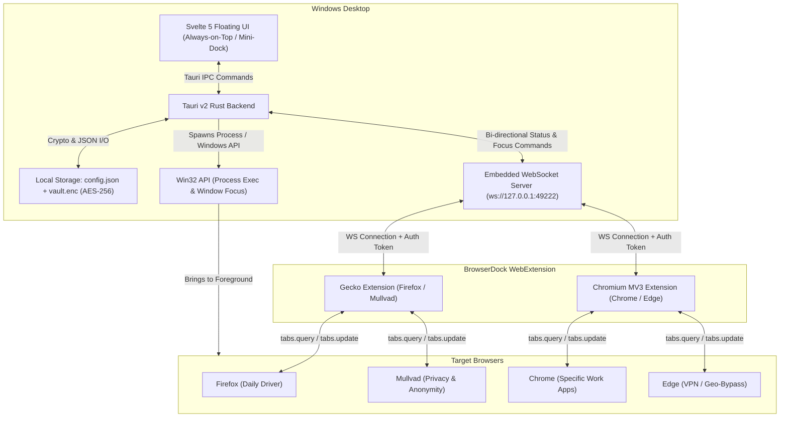

# Product & Engineering Specification: BrowserDock

**Document Version:** 1.1.0  
**Target Platform:** Windows 10 / Windows 11 (x64 / ARM64)  
**Architecture:** Tauri v2 (Rust Backend + Svelte 5 / Tailwind Frontend) + Universal WebExtension Companion  
**Primary Goal:** Provide a lightweight, always-on-top floating dock and command palette that manages bookmarks, automatically routes URLs to designated browsers (Firefox, Mullvad, Chrome, Edge), focuses existing tabs across browsers, and protects sensitive sites with a PIN-locked encrypted vault.

---

## 1. Executive Architecture & Technology Choice

### 1.1 Why Tauri v2 + Svelte 5 + Rust?
Running 4 web browsers simultaneously (Firefox, Mullvad, Chrome, Edge) consumes gigabytes of memory. An always-on-top launcher must **never** be an Electron app (~200MB+ RAM overhead).
* **Memory target:** Under 40 MB for the release app; measure on native Windows and state whether WebView2 child processes are included. This is a target, not a verified result.
* **Native Windows Integration:** Rust provides direct access to Win32 APIs (`windows-rs`) for `SetForegroundWindow`, `BringWindowToTop`, registry querying for browser paths, and global hotkeys.
* **Security & Crypto:** The Rust implementation uses `aes-gcm` and `argon2`; see §3.2 and the [vault security boundary](docs/phase-6-7.md#storage-and-security-boundary).
* **Reactive Frontend:** Svelte 5 with Tailwind v3; target responsive interaction and verify performance on Windows.

### 1.2 High-Level System Architecture



---

## 2. Functional Requirements & Features

### 2.1 Always-On-Top Floating Dock & Summon Modes
* **Dock Mode (Floating Pill):**
  * Sleek, draggable, semi-transparent bar pinned to any screen edge or free-floating.
  * Win32 Window Styles: `WS_EX_TOPMOST`, `WS_EX_TOOLWINDOW` (hide from Alt+Tab switcher; maps to Tauri `skipTaskbar: true`).
  * Default collapsed geometry is 400px wide x 56px high (`src-tauri/tauri.conf.json`); persisted resizing follows §5.2. Note: `transparent: true` is incompatible with native `shadow` on WebView2, so `shadow` MUST be `false`.
  * Auto-hide option: Snaps to screen border and collapses into a thin indicator strip, expanding on mouse hover.
* **Command Palette Mode (Quick Launcher):**
  * Summoned via system-wide global hotkey (default: `Ctrl + Shift + Space`; `Alt + Space` is reserved by the Windows window-menu and MUST NOT be the default; `Win + Shift + B` remains an allowed alternative).
  * Requires `tauri-plugin-global-shortcut` (backend) plus single-instance handling so a second launch summons the running dock.
  * Instant cursor focus on search input. Pressing `Esc` once hides the window (see Panic Key for double-`Esc` behavior).

### 2.2 Unified Search & Smart Routing
* **Input Box:**
  * Typing text filters bookmarks via fuzzy search (powered by `fuse.js` or Rust-side fuzzy matcher).
  * Typing or pasting a URL directly parses domain and path.
* **Automated Browser Dispatcher:**
  * Every bookmark has an assigned browser target: `Firefox`, `Mullvad`, `Chrome`, `Edge`, or `Custom`.
  * For typed URLs, **Domain Routing Rules** are evaluated in priority order (ascending: lower `priority` number wins; first match wins; ties broken by `id` ascending). Matching is case-insensitive on host; glob syntax supports `*` (any run) and `?` (single char), with `*://` matching any scheme. If no rule matches, the default fallback browser is `firefox`:
    * Glob matching (no implicit regex mode) (e.g., `*.google.com`, `docs.google.com` -> Chrome; `*.onion`, `privacy-check.me` -> Mullvad; `*.geo-blocked.tv` -> Edge; default fallback -> Firefox).
  * **Manual Hotkey Override:** User can override target browser before pressing Enter (e.g., `Alt+1` or `Alt+F` for Firefox, `Alt+2` or `Alt+M` for Mullvad, etc.).

### 2.3 Tab Switching & Focus (The Companion Extension)
* **Problem:** Windows OS can only bring a browser window to the front; it cannot read or switch internal browser tabs.
* **Foreground caveat:** Win32 `SetForegroundWindow` is subject to the foreground-lock timeout and can fail when the dock is not the foreground process. The Rust helper MUST use the `AttachThreadInput` + `AllowSetForegroundWindow` + `ShowWindow(SW_RESTORE)` + `BringWindowToTop` best-effort sequence (see `src-tauri/src/win32_helper.rs`); the extension's `windows.update({focused:true})` is the more reliable tab-bring-to-front path.
* **Connection model:** each extension instance connects independently. The server keys connections by per-connection UUID carrying a claimed `browser` id (`firefox` | `mullvad` | `chrome` | `edge`); multiple instances may share one `browser` id (e.g. Firefox + Mullvad both Gecko). The server MUST NOT key the registry by bare `browser_id` alone.
* **Solution:**
  1. User selects or clicks a site (e.g., `github.com`).
  2. BrowserDock selects a connected instance of the routed browser, using cached inventory as a hint; that companion queries actual tabs before matching.
  3. **If Tab is Open:**
     * The companion extension executes `chrome.tabs.update(tabId, { active: true })` and `chrome.windows.update(windowId, { focused: true })`.
     * Native foregrounding is best effort, never guaranteed. Extension `window_id` values are not Win32 HWNDs and must not be passed to Win32 APIs.
  4. **If Tab is NOT Open:**
     * If a companion is connected: it creates an eligible tab/window according to §4.2.
     * If no companion is available before dispatch: Rust launches the selected browser via `std::process::Command`, with validated arguments and URL last. Safe fallback cases are defined in §4.2.

### 2.4 Private Vault (PIN-Protected Bookmarks)
* **Visual Isolation:**
  * The UI features a distinct "Vault" tab marked with a lock icon.
  * In the locked state, private bookmarks are unmounted from the DOM, excluded from search, and their decrypted bytes plus derived keys are dropped/zeroized; only the `vault.enc` ciphertext bytes may remain.
* **Browser identity:** Mullvad Browser spoofs `navigator.userAgent` for anti-fingerprinting, so extensions MUST NOT rely on UA sniffing. Each companion build (or user setting) MUST carry an explicit `browser` id.
* **Encryption Scheme:**
  * Master PIN / Passphrase is processed through **Argon2id** (memory-hard key derivation, recommended params: `m=19456 KiB (19 MiB), t=2, p=1`, 32-byte output; 16-byte random salt per vault).
  * Data encrypted at rest using **AES-256-GCM** with a cryptographically secure random 96-bit nonce stored in `vault.enc`.
  * Minimum vault secret length is 8 characters; short numeric-only PINs MUST be rejected at set-time because `vault.enc` is offline-brute-forceable (in-app lockout does not protect a copied file).
* **Security Safeguards:**
  * **Auto-Lock Timer:** Configurable timeout (default: 5 minutes, `vault_timeout_minutes` in `config.json`) of user inactivity locks the vault and purges plaintext keys from memory (zeroized).
  * **Panic Key / Boss Key:** Pressing `Esc` once hides the window; pressing `Esc` twice within ~400 ms or a custom hotkey (`Ctrl + Alt + L`) immediately wipes memory state, closes any private launcher views, and re-locks the vault.
  * **Zero Telemetry / Offline:** All operations run locally on `127.0.0.1`.

---

## 3. Data Schema & Specifications

### 3.1 Configuration File (`config.json`)
Location: `%APPDATA%/BrowserDock/config.json`

```json
{
  "version": "1.1.0",
  "settings": {
    "always_on_top": true,
    "global_shortcut": "Ctrl+Shift+Space",
    "panic_shortcut": "Ctrl+Alt+L",
    "theme": "sage",
    "dock_position": {
      "x": 100,
      "y": 100,
      "snapped": false
    },
    "auto_hide": false,
    "vault_timeout_minutes": 5,
    "ws_port": 49222,
    "auth_token": "random_uuidv4_generated_on_first_run",
    "hide_on_open": true,
    "auto_tab_groups": true,
    "opacity": 1.0
  },
  "browsers": [
    {
      "id": "firefox",
      "name": "Firefox",
      "exe_path": "C:\\Program Files\\Mozilla Firefox\\firefox.exe",
      "args": [
        "-new-tab"
      ],
      "color": "#FF7139",
      "extra_args": [],
      "container": null
    },
    {
      "id": "mullvad",
      "name": "Mullvad Browser",
      "exe_path": "C:\\Program Files\\Mullvad Browser\\mullvadbrowser.exe",
      "args": [],
      "color": "#218838",
      "extra_args": [],
      "container": null
    },
    {
      "id": "chrome",
      "name": "Google Chrome",
      "exe_path": "C:\\Program Files\\Google\\Chrome\\Application\\chrome.exe",
      "args": [],
      "color": "#4285F4",
      "extra_args": [],
      "profile": null
    },
    {
      "id": "edge",
      "name": "Microsoft Edge",
      "exe_path": "C:\\Program Files (x86)\\Microsoft\\Edge\\Application\\msedge.exe",
      "args": [],
      "color": "#0078D7",
      "extra_args": [],
      "profile": null
    }
  ],
  "routing_rules": [
    {
      "id": "rule-1",
      "pattern": "*://*.google.com/*",
      "target_browser": "chrome",
      "priority": 10
    },
    {
      "id": "rule-2",
      "pattern": "*://*.onion/*",
      "target_browser": "mullvad",
      "priority": 20
    },
    {
      "id": "rule-3",
      "pattern": "*://forbidden-site.org/*",
      "target_browser": "edge",
      "priority": 30
    }
  ],
  "bookmarks": [
    {
      "id": "bm-1",
      "title": "GitHub",
      "url": "https://github.com",
      "target_browser": "firefox",
      "tags": [
        "dev",
        "daily"
      ],
      "icon": "github",
      "group_id": "grp-work",
      "parent_id": null,
      "sort_order": 0,
      "browser_options": {
        "profile": null,
        "container": null,
        "incognito": false
      }
    }
  ],
  "groups": [
    {
      "id": "grp-work",
      "name": "Work",
      "color": "#b8edc9",
      "sort_order": 0,
      "collapsed": false
    }
  ]
}
```

Configuration versions `1.0.0` and `1.1.0` are accepted. Loading `1.0.0` first writes a byte-for-byte `config.json.bak.<timestamp>` backup, then saves version `1.1.0` with groups and bookmark order defaults. Unknown fields and unreadable bookmark entries remain on disk; unreadable entries produce a dock warning. Missing `hide_on_open` defaults to `true`; missing opacity defaults to `1.0`, and hand-edited values clamp to `0.3–1.0`. Settings saves reject out-of-range opacity.

Groups are scoped to public or private bookmarks. Each scope allows at most 50 groups, names of 1–64 characters, optional hex colors, stable order and a collapsed flag. Missing/null `group_id` means Ungrouped, rendered last. Bookmark ordering uses `sort_order`, title, then ID within each `(group_id, parent_id)` sibling set, renormalized from zero. Deleting a group moves bookmarks to Ungrouped. Private groups and launch options are stored only in the vault.

Optional `parent_id` is a nonempty ID of at most 128 bytes; absent/null means root. Trees allow root → child → grandchild. Parents must exist in the same public/vault scope; self-links, cycles and deeper trees are rejected. Saving/moving a child copies its parent's group; moving a parent between groups also updates its descendants. Deleting a bookmark preserves its children, appending them in sibling order under its former parent (or at root) in the same atomic write. Invalid parent links in hand-edited public config render as roots with a dock warning, without rewriting the stored data on read. Organization patches preserve unknown public fields and unreadable entries. Existing config/vault versions and the encrypted binary layout are unchanged.

`settings.theme` accepts `sage` (default), `nord`, `amber`, `tokyo`, or `rose`. Missing, legacy `dark`, and unknown values load as `sage`; settings saves reject unsupported IDs. Saving settings persists the normalized choice without a schema-version migration.

Browser defaults support `profile` for Chrome/Edge, `container` for Firefox/Mullvad, and `extra_args`. Bookmarks and routing rules may carry `browser_options: {profile?, container?, incognito?}`. Bookmark options take precedence over defaults; typed URLs use matching rule options before browser defaults. Empty profile/container values inherit defaults. Explicit browser overrides bypass routing rules. Names allow 1–128 ASCII letters, digits, spaces, underscores, dots and hyphens; `.` and `..` are invalid. Extra arguments allow at most 20 entries of 256 characters and reject shell metacharacters/control characters. Process arguments are always separate argv entries with the URL last.

### 3.2 Encrypted Vault File (`vault.enc`)
Location: `%APPDATA%/BrowserDock/vault.enc`

Binary format (unchanged; the payload version is inside the ciphertext):
* `[0..16]`: Salt for Argon2id (16 bytes, random per vault).
* `[16..28]`: AES-GCM Nonce / IV (12 bytes, random per encryption).
* `[28..N]`: AES-256-GCM ciphertext with the 16-byte auth tag appended (`ciphertext || tag`, as produced by `aes-gcm`). Decryption MUST fail closed on tag mismatch.

The decrypted payload is `{ "version": 2, "bookmarks": [...], "groups": [...] }`. The reader also accepts legacy bookmark arrays and version-1 envelopes; legacy entries become Ungrouped with index ordering. The next successful mutation writes version 2 atomically. No salt/nonce/tag layout change occurs. Lock, timeout and failed mutations drop/zeroize private groups, options and bookmark strings as well as keys and plaintext buffers.

---

## 4. Inter-Process Communication (IPC) Protocol

### 4.1 WebSocket Connection
* The Rust backend binds to `127.0.0.1:{ws_port}` (`ws_port` from `config.json`, default `49222`; if occupied, try the next free port and log it — the port is authoritative from config, never hardcoded in the extension build).
* When the companion extension loads, it initiates a WebSocket handshake, then MUST send within 5s:
  * Headers / Initial Frame: `{ "type": "AUTH", "token": "<auth_token>", "browser": "firefox|mullvad|chrome|edge", "instance_id": "<uuidv4 per extension instance>" }`
* The server MUST close unauthenticated/mistokened sockets without revealing whether the token or format was wrong. `auth_token` is a random UUIDv4 generated on first run (122-bit entropy); it is a local-only bearer secret, so `config.json` file permissions are part of the threat model.
* Chromium and Gecko builds ship separate manifests (Chromium MV3 `background.service_worker` vs Gecko `background.scripts` + `browser_specific_settings.gecko`). A single manifest containing both keys is invalid and MUST NOT be used.

### 4.2 Message Schemas

#### A. Focus or Open Tab (Dock -> Extension)
Authoritative field names (extensions and server MUST use exactly these):
```json
{
  "id": "req-101",
  "action": "FOCUS_OR_OPEN",
  "url": "https://example.com",
  "match_mode": "domain_or_exact",
  "container": "work",
  "profile": null
}
```

`container` and `profile` are optional and additive. Gecko resolves a container name or cookie-store ID using `contextualIdentities`; existing tabs must also match that cookie store. A missing container returns `ERROR_CONTAINER_NOT_FOUND`, allowing a plain process open with a visible note. Edge also permits process fallback for `ERROR_NO_BROWSER_WINDOW`, sent only when the companion finds no eligible normal window before any tab operation. This safely handles a background-only Edge instance; no other browser API errors permit retry. A companion unavailable before dispatch also permits process fallback; disconnection after dispatch does not. Ambiguous timeouts and unrelated browser API failures remain errors to avoid duplicate tabs. Private/incognito launches bypass companion reuse and start a new browser window.

#### B. Close Tabs (Dock -> Extension)
Same envelope with `"action": "CLOSE_TABS"`; `match_mode` accepts `domain_or_exact` or `exact` (`new_tab` is rejected). The extension closes every tab matching the focus candidate filters (exact URL first, then hostname; container-scoped on Gecko; private tabs need the same opt-in) with a single `tabs.remove` call and replies `{id, status: "SUCCESS", result: "CLOSED_TABS", closed: <n>}`. No match returns `ERROR_TAB_NOT_FOUND` without mutation. There is no process fallback for close: a missing companion or no matching tab is reported, never launched. Timeouts/disconnects are reported once and never retried, since the tabs may already be closed.

Chrome/Edge profiles are passed as `--profile-directory=<directory>` before the URL on process launches. Companion profile hints do not enforce profile selection: tab reuse targets a connected instance. Install a companion in each profile; native warm-profile behavior remains browser dependent.

#### C. Extension Response (Extension -> Dock)
Authoritative shape (do not use bare `status: FOCUSED/OPENED`):
```json
{
  "id": "req-101",
  "status": "SUCCESS",
  "result": "FOCUSED_EXISTING",
  "window_id": 12,
  "tab_id": 44
}
```
Successful responses use `status: "SUCCESS"` and `result: FOCUSED_EXISTING | OPENED_NEW_TAB | CLOSED_TABS`. Errors use `status: "ERROR"` and an `ERROR_*` result; close success includes `closed`.

#### D. Tab Inventory Broadcast (Extension -> Dock)
Sent on tab updates (debounced ≥500 ms, capped at 200 tabs per message, URLs truncated to 2 KB), allowing the dock UI to render an indicator on bookmarks that are currently open.
```json
{
  "action": "TABS_SYNC",
  "browser": "firefox",
  "tabs": [
    { "id": 44, "url": "https://github.com/pulls", "title": "Pull Requests", "cookieStoreId": "firefox-container-1" },
    { "id": 52, "url": "https://news.ycombinator.com", "title": "Hacker News" }
  ]
}
```

Gecko inventory includes optional `cookieStoreId`; Chromium omits it. After authentication and on contextual-identity changes, Gecko sends `{ "action": "CONTAINERS_LIST", "containers": [{ "name": "work", "cookieStoreId": "firefox-container-1" }] }`. This local in-memory inventory provides container name hints; it is not written to config. Only Gecko requests `contextualIdentities` and `cookies` permissions (`cookies` is needed for cookie-store tab operations).

### 4.2.1 Companion reliability extensions (v1.0.3)

- `AUTH_OK` includes `capabilities: ["paged_tabs_v1"]`. Legacy companions ignore the field; new companions use legacy `TABS_SYNC` when it is absent.
- `FOCUS_OR_OPEN` and `CLOSE_TABS` include optional `deadline_ms`, an absolute Unix timestamp in milliseconds, five seconds after dispatch. The companion checks expiry before issuing subsequent mutations and caps execution at five seconds after receipt. Queues belong to individual connections; a watchdog disconnects stalled commands. Expired queued commands return `ERROR_REQUEST_EXPIRED`; invalid deadlines return `ERROR_INVALID_REQUEST`. Already-issued browser API operations are irreversible and must never be retried automatically.
- Negotiated inventory messages are `{action:"TABS_SYNC_PAGE",browser,snapshot_id,page,pages,tabs}`. `snapshot_id` is a UUID, pages are zero-based and ordered, each page has at most 200 tabs, and a snapshot has at most 10 pages/2,000 tabs. Non-final pages contain exactly 200 tabs. Empty inventories use one empty page. Duplicate tab IDs across pages, invalid bounds, or mismatched/out-of-order pages reject the connection. A partial snapshot must finish within five seconds; expiry is checked on page receipt. Only a validated final page atomically replaces the previous snapshot. The sender spaces snapshots by at least 500 ms; the server accepts every complete valid snapshot because transport stalls can compress arrival times. Starting page zero replaces any incomplete assembly. Legacy inventories cancel an incomplete assembly and retain their 200-tab limit.
- Unchanged negotiated inventories are suppressed. Legacy-server inventories are periodically refreshed because older servers may silently drop closely arriving snapshots. Tab updates unrelated to URL/title/load status/container do not trigger inventory queries. All caches are in memory only; private opt-in and URL validation remain mandatory. Tabs above the bounded snapshot limit are excluded from routing hints.
- The options page displays live status through same-extension `BROWSERDOCK_STATUS` messaging. Replies contain only a connection state. Pairing input is limited to 16 KB and stale asynchronous file imports cannot overwrite later user actions.

### 4.2.2 Native browser tab groups (companion v1.0.4)

Both distributions request `tabGroups`; grouping is feature-detected so unavailable APIs can still open ordinary tabs. The companion advertises `capabilities:["tab_groups_v1"]` in `AUTH`. Legacy companions still accept individual opens; a grouping request to one returns an update notice. Batch actions require the advertised capability and are rejected before dispatch to a legacy companion.

- `FOCUS_OR_OPEN` accepts optional `tab_group:{name,color?,collapsed?}`. Names contain 1–64 Unicode characters; colors are optional `#RGB`/`#RRGGBB`, mapped to the nearest of the nine browser colors. Grouped Edge opens can create a missing tab in a verified eligible window; ordinary Edge opens retain §4.2A's process handoff behavior.
- `OPEN_GROUP` uses `{id,action,urls,tab_group,container?,profile?,deadline_ms}`. The same envelope with `action:"CLOSE_GROUP"` omits URLs. Requests have at most 50 bookmarks and a 16 KB frame limit. Desktop preflight reserves framing space by limiting each serialized URL array to 14 KB. Browser/profile/container/incognito differences split dock groups into separate batches, each sent to one connected instance.
- Open chooses one eligible normal window (focused, recently focused, then first), reuses exact URLs within it, creates missing tabs, and groups them with one `tabs.group` call. Same-title groups are reused within that window only when their members share the tab's cookie store. Shared groups are excluded from title-based reuse and closing. Browser group IDs are ephemeral and never persisted. Dock groups with the same name can intentionally resolve to the same browser group; renaming a dock group does not rename existing browser groups.
- Close selects one instance per resolved browser/options batch, preferring matching title/container inventory, and removes all tabs with that exact native group title across its eligible windows, filtered by the requested container and private-tab opt-in. This includes manually added group tabs. It never falls back to URL/hostname closing or process launch. Missing native groups return `ERROR_TAB_NOT_FOUND`; unsupported grouping returns an error.
- Open replies use `SUCCESS/OPENED_GROUP` with `window_id`, `tab_id`, and optional bounded `note`; close reuses `SUCCESS/CLOSED_TABS` with `closed`. Unsupported/disabled grouping leaves opened tabs in place and reports a note. If grouping is unavailable or fails, batch open activates the first opened/reused tab even when the dock group is collapsed; successful collapsed groups do not activate a member. Browser batches are **not atomic**: deadlines, disconnects, or API failures may leave partial work, which is reported without replay or process fallback. A missing companion before dispatch may open ordinary tabs; incognito options always use process launch and are not group-closeable.
- `CANCEL_REQUEST {id}` is connection-local and stops subsequent mutations in a pending command. Desktop private group requests monitor the vault session and send cancellation when it becomes invalid. Already-issued browser API operations cannot be undone. Private group hints and batch URLs remain in memory only and are zeroized when released; locking clears private frontend groups and ignores stale outcomes.
- Inventory adds optional `groupId`, `groupTitle` (≤64 characters), `groupColor` (one of the nine enum names), and `groupCollapsed`. These fields work with legacy and paged snapshots. The compact desktop digest retains title/color and distinguishes same-host tabs in different groups. Group events and tab `groupId` changes trigger the existing debounced snapshot pipeline. Group inventory is queried once per snapshot; failed group queries still allow plain tab inventory.

### 4.3 Desktop commands

The unused `detect_browsers` and `launch_url` desktop commands were removed during QA. Browser detection remains internal; `open_url` launches individual bookmarks/URLs; `open_group` launches bookmark groups. `dock_hide` and `dock_escape` return failures to the UI, and background window-operation failures emit `dock-error`. The frontend marks a successful post-launch hide only after the native operation succeeds.

The desktop webview communicates via Tauri IPC only; its CSP grants no direct WebSocket access. Companion extensions retain `ws://127.0.0.1:*` for port fallback. Restrict `%APPDATA%\BrowserDock` using Windows user ACLs, never share the plaintext bearer token, and use a strong nonnumeric vault passphrase: copying ciphertext bypasses the app's retry lockout. DPAPI token wrapping remains a follow-up.

Existing command names remain available. Tauri JavaScript arguments use camelCase.

- `get_dock_data` includes public `groups`, `bookmarks`, `browsers`, public `settings`, and warnings; pairing secrets are excluded.
- `vault_list` returns `{bookmarks, groups}`. The frontend also accepts the legacy bookmark-array response. Locked or cancelled sessions cannot read/mutate private data.
- `save_group {group, private}`, `delete_group {id, private}`, and `move_bookmark {id, groupId, index, private, parentId?}` persist within one scope. Omitted `parentId` preserves the parent, `null` moves to root, and a string nests under that parent and inherits its group. Index is clamped within the destination sibling set and order is renormalized; failed validation/writes do not commit partial changes.
- `save_browser {browser}` updates an existing browser's executable, compatibility args, profile/container defaults and advanced extra arguments. All launch commands read current settings immediately.
- `open_url {url, browserId?, forceNewTab?, bookmarkId?, bookmarkPrivate?}` resolves a stored bookmark's URL/options when supplied. `bookmarkPrivate` disambiguates IDs shared between scopes; omission searches public then unlocked vault. Result adds optional `note` for container fallback.
- `open_group {groupId, private, browserId?}` and `close_group_tabs {groupId, private}` resolve the stored group and bookmarks within one public/vault scope. Results are `{processed, note?}`. Group opens respect bookmark options and the optional browser override; close respects each stored target. Private commands require a valid unlocked session.
- `open_bookmark_tree {id, private}` resolves one stored subtree in depth-first order, parent first and siblings by stored order/title/ID. It allows at most 50 URLs including the parent; exceeding this returns `A bookmark subtree can open at most 50 URLs including its parent` before dispatch. The group hint uses the parent's trimmed title (first 64 characters), optional group color and no collapsed hint. It reuses the guarded group dispatcher and `{processed, note?}` result, including per-option batching, the 14 KB URL-array guard, private-session cancellation, incognito process launches and no retry after ambiguous dispatch. Opening requests browser foregrounding; there is no separate subtree-close command.
- `close_tab {url, browserId?, exactMatch?, bookmarkId?, bookmarkPrivate?}` closes open tabs via the companion using the same bookmark resolution. Result is `{browser_id, result: CLOSED_TABS | TAB_NOT_FOUND, closed, note?}`. No companion, or no matching tab, is reported — never launched.
- `route_url` still returns the browser ID. `route_details {url, browserId?, bookmarkId?, bookmarkPrivate?}` returns `{browser_id, profile, container, incognito}`.
- `browser_profiles {browserId}` returns best-effort Chromium profile directories from Local State or connected Gecko container names; unavailable discovery yields an empty list.

---

## 5. User Experience & Interaction Design

### 5.1 The Mini-Dock Widget
* Default collapsed dimensions: 400px wide x 56px high; user resizing follows §5.2.
* Visual Hierarchy:
  1. **Left:** App / Shield Icon (Shows green when Vault is unlocked, grey when locked).
  2. **Center:** Instant Search input with placeholder: `Type URL or search bookmarks...`
  3. **Right:** Quick Browser indicator chips (`[F]`, `[M]`, `[C]`, `[E]`) + Vault Lock toggle.
* **Keyboard Navigation:**
  * `Down Arrow` / `Up Arrow`: Navigate search results.
  * `Enter`: Open / focus with default or rule-based browser.
  * `Shift + Enter`: Open a parent's entire subtree; for a leaf or typed URL, force a new tab.
  * `Right Arrow` / `Left Arrow`: Expand/collapse the focused or selected parent in the grouped view.
  * `Alt + F`: Route to Firefox.
  * `Alt + M`: Route to Mullvad.
  * `Alt + C`: Route to Chrome.
  * `Alt + E`: Route to Edge.

### 5.2 Visibility, opacity and organization

`always_on_top` controls z-order only. `hide_on_open` (default true) hides after a successful launch. Turning it off clears the query/browser override, preserves expanded state and shows the target browser notice without stealing focus back. Failed launches stay visible. `auto_hide` independently collapses the idle dock to a strip; Escape and tray controls retain their behavior.

`auto_tab_groups` defaults to true, including for older configs. Individual grouped bookmarks pass their stored group hint when enabled. Settings → Behavior can disable automatic grouping; explicit group actions remain available. Group headers provide Open Group in Browser and, when matching native group inventory exists, Close Group Tabs. Bookmark rows show a title/color badge from browser inventory using the existing host/container indicator semantics.

Settings provides a 30–100% background-opacity slider in 5% steps, with an unsaved live preview. Save persists it; cancel discards the preview. Text and borders keep their opacity, and reduced-motion users see instant changes.

Settings → Appearance offers Sage Mint, Nord Frost, Midnight Amber, Tokyo Violet and Rosé Pine through keyboard-accessible radio cards. Theme selection previews immediately throughout the dock; Save persists it, and Discard or leaving after discarding restores the committed theme. CSS tokens control surfaces, text and accents without remote assets or runtime dependencies. Token contrast is checked against opaque base surfaces; arbitrary desktop backgrounds at reduced opacity require visual acceptance.

The main dock window is resizable. `window_size.width` is clamped to 280–800 px (default 400); `window_size.height` is `null` for automatic content height or a manual value when explicitly resized/configured. Manual height applies to expanded panels only: Collapse always shrinks the native window to the 56px pill, and expanding restores the saved manual height. Startup also uses the pill height. The 6px auto-hide strip takes precedence over both modes. Size changes are applied live and persisted on commit, while cancel restores the last committed size. The resize grip is hidden in strip mode, and resizing preserves the snapped screen edge.

An empty query displays collapsible group sections and bookmark trees; search displays flat results with group/parent badges and includes group names at low fuzzy weight. Root ranking preserves attached descendants, and keyboard navigation skips collapsed branches. Parents have a 28px chevron and an always-visible `+N` descendant-count button that opens the subtree. Normal click/Enter opens only that bookmark. Indentation preserves the 52px row estimate and existing row actions.

Drag existing bookmark rows onto a row's top insertion edge to reorder siblings, or hover its body for 250ms to nest as its last child. Group-header drops move to the root end. Same-scope and depth/cycle rules apply; Escape cancels dragging, and failed writes restore the prior order. BookmarkEditor offers a Parent select with valid candidates and breadcrumbs; selecting a parent locks Group to its group. New bookmarks start at root. Expansion defaults to collapsed and stores only expanded entry IDs/booleans in `browserdock:tree-expanded:v1`; private keys are purged whenever private rows are cleared, including Escape and vault lock. Startup does not restore private expansion. GroupEditor supports rename, color, deletion confirmation and up/down ordering; group-header dragging is not implemented. Locking unmounts private rows, groups and editors and ignores stale private outcomes.

BookmarkEditor offers contextual profile/container inputs and a private/incognito toggle. Advanced browser settings include default options and extra arguments. Resolved target labels include the profile or container. Container fallback notes remain visible even when the default post-open hide behavior is enabled, and appear on the next summon.

### 5.3 The Vault Unlock Modal
* Trigger: Clicking Lock icon or typing `/vault` into search.
* Visual: Masked passphrase input; creation requires at least eight characters and rejects numeric-only secrets.
* Behavior:
  * 3 consecutive invalid PINs trigger a 30-second lockout.
  * Valid PIN derives AES key, decrypts `vault.enc`, and adds private bookmarks to the search list with a distinct badge.

---

## 6. Original roadmap (implemented)

See [PROGRESS.md](PROGRESS.md) for current status and remaining native validation. These milestones describe the initial build, not pending work.

1. **Milestone 1: Tauri Project Setup & Native Window Controls**
   * Tauri v2 initialization with Svelte 5 and Tailwind CSS.
   * Configure borderless window, always-on-top flags, and Win32 drag-region.
2. **Milestone 2: Configuration & Process Launcher**
   * Implement `config.json` reader/writer.
   * Auto-detect default browser paths from Windows Registry (`HKEY_LOCAL_MACHINE\SOFTWARE\Clients\StartMenuInternet`).
   * Implement CLI launcher with fallback execution.
3. **Milestone 3: Companion WebExtension & WebSocket IPC**
   * Build cross-browser WebExtension (Chromium MV3 build for Chrome/Edge + Gecko-compatible build for Firefox/Mullvad; two manifest variants — never one manifest with both `service_worker` and `scripts`).
   * Implement Rust embedded WebSocket server on `127.0.0.1:{ws_port}` (default `49222`, with next-free-port fallback).
   * Registry keyed by per-connection `instance_id` (not bare `browser_id`); enforce `AUTH` token; implement `FOCUS_OR_OPEN` command and window foregrounding via Win32 best-effort sequence (`AttachThreadInput` workaround).
4. **Milestone 4: Private Vault & Crypto Engine**
   * Implement Argon2id + AES-256-GCM encryption in Rust.
   * Implement auto-lock countdown and panic key listener.
5. **Milestone 5: Polish & Distribution**
   * System tray integration (Show/Hide, Lock Vault, Settings, Exit).
   * Windows `.msi` and portable `.exe` bundle generation.
