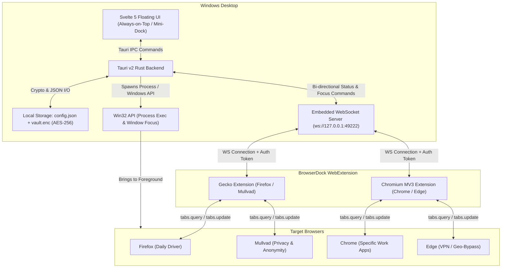

# Product & Engineering Specification: BrowserDock

**Document Version:** 1.1.0  
**Target Platform:** Windows 10 / Windows 11 (x64 / ARM64)  
**Architecture:** Tauri v2 (Rust Backend + Svelte 5 / Tailwind Frontend) + Universal WebExtension Companion  
**Primary Goal:** Provide a lightweight, always-on-top floating dock and command palette that manages bookmarks, automatically routes URLs to designated browsers (Firefox, Mullvad, Chrome, Edge), focuses existing tabs across browsers, and protects sensitive sites with a PIN-locked encrypted vault.

---

## 1. Executive Architecture & Technology Choice

### 1.1 Why Tauri v2 + Svelte 5 + Rust?
Running 4 web browsers simultaneously (Firefox, Mullvad, Chrome, Edge) consumes gigabytes of memory. An always-on-top launcher must **never** be an Electron app (~200MB+ RAM overhead).
* **Memory target:** Under 40 MB for the release app; measure on native Windows and state whether WebView2 child processes are included. This is a target, not a verified result. See [PROGRESS.md](PROGRESS.md) for acceptance status.
* **Native Windows Integration:** Rust provides direct access to Win32 APIs (`windows-rs`) for `SetForegroundWindow`, `BringWindowToTop`, registry querying for browser paths, and global hotkeys.
* **Security & Crypto:** The Rust implementation uses `aes-gcm` and `argon2`; see §3.2 and the [vault security boundary](docs/phase-6-7.md#storage-and-security-boundary).
* **Reactive Frontend:** Svelte 5 with Tailwind v3; target responsive interaction and verify performance on Windows.

### 1.2 High-Level System Architecture


```mermaid
flowchart TD
    subgraph Desktop ["Windows Desktop"]
        UI["Svelte 5 Floating UI (Always-on-Top / Mini-Dock)"]
        Rust["Tauri v2 Rust Backend"]
        WS["Embedded WebSocket Server (ws://127.0.0.1:49222)"]
        Storage["Local Storage: config.json + vault.enc (AES-256)"]
        Win32["Win32 API (Process Exec & Window Focus)"]
    end

    subgraph Browsers ["Target Browsers"]
        FF["Firefox (Daily Driver)"]
        MV["Mullvad (Privacy & Anonymity)"]
        CH["Chrome (Specific Work Apps)"]
        ED["Edge (VPN / Geo-Bypass)"]
    end

    subgraph Extension ["BrowserDock WebExtension"]
        ExtFF["Gecko Extension (Firefox / Mullvad)"]
        ExtCH["Chromium MV3 Extension (Chrome / Edge)"]
    end

    UI <-->|Tauri IPC Commands| Rust
    Rust <-->|Crypto & JSON I/O| Storage
    Rust -->|Spawns Process / Windows API| Win32
    Win32 -->|Brings to Foreground| Browsers
    Rust <-->|Bi-directional Status & Focus Commands| WS
    WS <-->|WS Connection + Auth Token| ExtFF
    WS <-->|WS Connection + Auth Token| ExtCH
    ExtFF <-->|tabs.query / tabs.update| FF & MV
    ExtCH <-->|tabs.query / tabs.update| CH & ED
```

---

## 2. Functional Requirements & Features

### 2.1 Always-On-Top Floating Dock & Summon Modes
* **Dock Mode (Floating Pill):**
  * Sleek, draggable, semi-transparent bar pinned to any screen edge or free-floating.
  * Win32 Window Styles: `WS_EX_TOPMOST`, `WS_EX_TOOLWINDOW` (hide from Alt+Tab switcher; maps to Tauri `skipTaskbar: true`).
  * Default collapsed geometry is 400px wide x 56px high (`src-tauri/tauri.conf.json`); persisted resizing follows §5.2. Note: `transparent: true` is incompatible with native `shadow` on WebView2, so `shadow` MUST be `false`.
  * Auto-hide option: Snaps to screen border and collapses into a thin indicator strip, expanding on mouse hover.
* **Command Palette Mode (Quick Launcher):**
  * Summoned via system-wide global hotkey (default: `Ctrl + Shift + Space`; `Alt + Space` is reserved by the Windows window-menu and MUST NOT be the default; `Win + Shift + B` remains an allowed alternative).
  * Requires `tauri-plugin-global-shortcut` (backend) plus single-instance handling so a second launch summons the running dock.
  * Instant cursor focus on search input. Pressing `Esc` once hides the window (see Panic Key for double-`Esc` behavior).

### 2.2 Unified Search & Smart Routing
* **Input Box:**
  * Typing text filters bookmarks via fuzzy search (powered by `fuse.js` or Rust-side fuzzy matcher).
  * Typing or pasting a URL directly parses domain and path.
* **Automated Browser Dispatcher:**
  * Every bookmark has an assigned browser target: `Firefox`, `Mullvad`, `Chrome`, `Edge`, or `Custom`.
  * For typed URLs, **Domain Routing Rules** are evaluated in priority order (ascending: lower `priority` number wins; first match wins; ties broken by `id` ascending). Matching is case-insensitive on host; glob syntax supports `*` (any run) and `?` (single char), with `*://` matching any scheme. If no rule matches, the default fallback browser is `firefox`:
    * Glob matching (no implicit regex mode) (e.g., `*.google.com`, `docs.google.com` -> Chrome; `*.onion`, `privacy-check.me` -> Mullvad; `*.geo-blocked.tv` -> Edge; default fallback -> Firefox).
  * **Manual Hotkey Override:** User can override target browser before pressing Enter (e.g., `Alt+1` or `Alt+F` for Firefox, `Alt+2` or `Alt+M` for Mullvad, etc.).

### 2.3 Tab Switching & Focus (The Companion Extension)
* **Problem:** Windows OS can only bring a browser window to the front; it cannot read or switch internal browser tabs.
* **Foreground caveat:** Win32 `SetForegroundWindow` is subject to the foreground-lock timeout and can fail when the dock is not the foreground process. The Rust helper MUST use the `AttachThreadInput` + `AllowSetForegroundWindow` + `ShowWindow(SW_RESTORE)` + `BringWindowToTop` best-effort sequence (see `src-tauri/src/win32_helper.rs`); the extension's `windows.update({focused:true})` is the more reliable tab-bring-to-front path.
* **Connection model:** each extension instance connects independently. The server keys connections by per-connection UUID carrying a claimed `browser` id (`firefox` | `mullvad` | `chrome` | `edge`); multiple instances may share one `browser` id (e.g. Firefox + Mullvad both Gecko). The server MUST NOT key the registry by bare `browser_id` alone.
* **Solution:**
  1. User selects or clicks a site (e.g., `github.com`).
  2. BrowserDock selects a connected instance of the routed browser, using cached inventory as a hint; that companion queries actual tabs before matching.
  3. **If Tab is Open:**
     * The companion extension executes `chrome.tabs.update(tabId, { active: true })` and `chrome.windows.update(windowId, { focused: true })`.
     * Native foregrounding is best effort, never guaranteed. Extension `window_id` values are not Win32 HWNDs and must not be passed to Win32 APIs.
  4. **If Tab is NOT Open:**
     * If a companion is connected: it creates an eligible tab/window according to §4.2.
     * If no companion is available before dispatch: Rust launches the selected browser via `std::process::Command`, with validated arguments and URL last. Safe fallback cases are defined in §4.2.

### 2.4 Private Vault (PIN-Protected Bookmarks)
* **Visual Isolation:**
  * The UI features a distinct "Vault" tab marked with a lock icon.
  * In the locked state, private bookmarks are unmounted from the DOM, excluded from search, and their decrypted bytes plus derived keys are dropped/zeroized; only the `vault.enc` ciphertext bytes may remain.
* **Browser identity:** Mullvad Browser spoofs `navigator.userAgent` for anti-fingerprinting, so extensions MUST NOT rely on UA sniffing. Each companion build (or user setting) MUST carry an explicit `browser` id.
* **Encryption Scheme:**
  * Master PIN / Passphrase is processed through **Argon2id** (memory-hard key derivation, recommended params: `m=19456 KiB (19 MiB), t=2, p=1`, 32-byte output; 16-byte random salt per vault).
  * Data encrypted at rest using **AES-256-GCM** with a cryptographically secure random 96-bit nonce stored in `vault.enc`.
  * Minimum vault secret length is 8 characters; short numeric-only PINs MUST be rejected at set-time because `vault.enc` is offline-brute-forceable (in-app lockout does not protect a copied file).
* **Security Safeguards:**
  * **Auto-Lock Timer:** Configurable timeout (default: 5 minutes, `vault_timeout_minutes` in `config.json`) of user inactivity locks the vault and purges plaintext keys from memory (zeroized).
  * **Panic Key / Boss Key:** Pressing `Esc` once hides the window; pressing `Esc` twice within ~400 ms or a custom hotkey (`Ctrl + Alt + L`) immediately wipes memory state, closes any private launcher views, and re-locks the vault.
  * **Zero Telemetry / Offline:** All operations run locally on `127.0.0.1`.

---

## 3. Data Schema & Specifications

### 3.1 Configuration File (`config.json`)
Location: `%APPDATA%/BrowserDock/config.json`

```json
{
  "version": "1.1.0",
  "settings": {
    "always_on_top": true,
    "global_shortcut": "Ctrl+Shift+Space",
    "panic_shortcut": "Ctrl+Alt+L",
    "dock_shortcuts": {},
    "theme": "sage",
    "dock_position": {
      "x": 100,
      "y": 100,
      "snapped": false
    },
    "auto_hide": false,
    "vault_timeout_minutes": 5,
    "ws_port": 49222,
    "auth_token": "random_uuidv4_generated_on_first_run",
    "hide_on_open": true,
    "auto_tab_groups": true,
    "opacity": 1.0
  },
  "browsers": [
    {
      "id": "firefox",
      "name": "Firefox",
      "exe_path": "C:\\Program Files\\Mozilla Firefox\\firefox.exe",
      "args": [
        "-new-tab"
      ],
      "color": "#FF7139",
      "extra_args": [],
      "container": null
    },
    {
      "id": "mullvad",
      "name": "Mullvad Browser",
      "exe_path": "C:\\Program Files\\Mullvad Browser\\mullvadbrowser.exe",
      "args": [],
      "color": "#218838",
      "extra_args": [],
      "container": null
    },
    {
      "id": "chrome",
      "name": "Google Chrome",
      "exe_path": "C:\\Program Files\\Google\\Chrome\\Application\\chrome.exe",
      "args": [],
      "color": "#4285F4",
      "extra_args": [],
      "profile": null
    },
    {
      "id": "edge",
      "name": "Microsoft Edge",
      "exe_path": "C:\\Program Files (x86)\\Microsoft\\Edge\\Application\\msedge.exe",
      "args": [],
      "color": "#0078D7",
      "extra_args": [],
      "profile": null
    }
  ],
  "routing_rules": [
    {
      "id": "rule-1",
      "pattern": "*://*.google.com/*",
      "target_browser": "chrome",
      "priority": 10
    },
    {
      "id": "rule-2",
      "pattern": "*://*.onion/*",
      "target_browser": "mullvad",
      "priority": 20
    },
    {
      "id": "rule-3",
      "pattern": "*://forbidden-site.org/*",
      "target_browser": "edge",
      "priority": 30
    }
  ],
  "bookmarks": [
    {
      "id": "bm-1",
      "title": "GitHub",
      "url": "https://github.com",
      "target_browser": "firefox",
      "tags": [
        "dev",
        "daily"
      ],
      "icon": "github",
      "group_id": "grp-work",
      "parent_id": null,
      "sort_order": 0,
      "browser_options": {
        "profile": null,
        "container": null,
        "incognito": false
      }
    }
  ],
  "groups": [
    {
      "id": "grp-work",
      "name": "Work",
      "color": "#b8edc9",
      "sort_order": 0,
      "collapsed": false
    }
  ]
}
```

Configuration versions `1.0.0` and `1.1.0` are accepted. Loading `1.0.0` first writes a byte-for-byte `config.json.bak.<timestamp>` backup, then saves version `1.1.0` with groups and bookmark order defaults. Unknown fields and unreadable bookmark entries remain on disk; unreadable entries produce a dock warning. Missing `hide_on_open` defaults to `true`; missing opacity defaults to `1.0`, and hand-edited values clamp to `0.3–1.0`. Settings saves reject out-of-range opacity.

Groups are scoped to public or private bookmarks. Each scope allows at most 50 groups, names of 1–64 characters, optional hex colors, stable order and a collapsed flag. Missing/null `group_id` means Ungrouped, rendered last. Bookmark ordering uses `sort_order`, title, then ID within each `(group_id, parent_id)` sibling set, renormalized from zero. Deleting a group moves bookmarks to Ungrouped. Private groups and launch options are stored only in the vault.

Optional `parent_id` is a nonempty ID of at most 128 bytes; absent/null means root. Trees allow root → child → grandchild. Parents must exist in the same public/vault scope; self-links, cycles and deeper trees are rejected. Saving/moving a child copies its parent's group; moving a parent between groups also updates its descendants. Deleting a bookmark preserves its children, appending them in sibling order under its former parent (or at root) in the same atomic write. Invalid parent links in hand-edited public config render as roots with a dock warning, without rewriting the stored data on read. Organization patches preserve unknown public fields and unreadable entries. Existing config/vault versions and the encrypted binary layout are unchanged.

Within a bookmark tree, governed routing fields are `target_browser`, `browser_options.profile` and `browser_options.container`; `incognito` remains per bookmark. Nesting a node copies the new parent's governed routing through the moved branch. Editing a parent propagates changed routing through descendants that followed their parent before the edit, while pre-existing divergent children remain grandfathered Custom entries until Follow parent or an explicit reparent normalizes them. Un-nesting keeps the node's stored route. Deleting a middle node normalizes children adopted by a grandparent to that parent's route; children promoted to roots keep their own route. Public and private mutations apply these rules in the same atomic write, and public JSON patches retain unknown entry and `browser_options` fields. No schema or migration flag is added.

`settings.theme` accepts `sage` (default), `nord`, `amber`, `tokyo`, or `rose`. Missing, legacy `dark`, and unknown values load as `sage`; settings saves reject unsupported IDs. Saving settings persists the normalized choice without a schema-version migration.

`settings.dock_shortcuts` maps action IDs to canonical key combinations; omitted actions use the defaults in §5.1. Defaults are shared between frontend and backend through `src/lib/features/settings/shortcuts.json`. Older configs require no migration. Loading malformed/unsafe individual bindings restores their defaults; duplicate normalized dock bindings restore the complete default map. Settings saves reject unsupported combinations, duplicate Windows/dock bindings, active browser-number alias conflicts and reserved focus/text-editing keys. Letters/digits require a modifier other than Shift alone. Escape is reserved for Hide and panic lock; Tab remains native focus navigation.

Browser defaults support `profile` for Chrome/Edge, `container` for Firefox/Mullvad, and `extra_args`. Bookmarks and routing rules may carry `browser_options: {profile?, container?, incognito?}`. Bookmark options take precedence over defaults; typed URLs use matching rule options before browser defaults. Empty profile/container values inherit defaults. Explicit browser overrides bypass routing rules. Names allow 1–128 ASCII letters, digits, spaces, underscores, dots and hyphens; `.` and `..` are invalid. Extra arguments allow at most 20 entries of 256 characters and reject shell metacharacters/control characters. Process arguments are always separate argv entries with the URL last.

### 3.2 Encrypted Vault File (`vault.enc`)
Location: `%APPDATA%/BrowserDock/vault.enc`

Binary format (unchanged; the payload version is inside the ciphertext):
* `[0..16]`: Salt for Argon2id (16 bytes, random per vault).
* `[16..28]`: AES-GCM Nonce / IV (12 bytes, random per encryption).
* `[28..N]`: AES-256-GCM ciphertext with the 16-byte auth tag appended (`ciphertext || tag`, as produced by `aes-gcm`). Decryption MUST fail closed on tag mismatch.

The decrypted payload is `{ "version": 2, "bookmarks": [...], "groups": [...] }`. The reader also accepts legacy bookmark arrays and version-1 envelopes; legacy entries become Ungrouped with index ordering. The next successful mutation writes version 2 atomically. No salt/nonce/tag layout change occurs. Lock, timeout and failed mutations drop/zeroize private groups, options and bookmark strings as well as keys and plaintext buffers.

---

## 4. Inter-Process Communication (IPC) Protocol

### 4.1 WebSocket Connection
* The Rust backend binds to `127.0.0.1:{ws_port}` (`ws_port` from `config.json`, default `49222`; if occupied, try the next free port and log it — the port is authoritative from config, never hardcoded in the extension build).
* When the companion extension loads, it initiates a WebSocket handshake, then MUST send within 5s:
  * Headers / Initial Frame: `{ "type": "AUTH", "token": "<auth_token>", "browser": "firefox|mullvad|chrome|edge", "instance_id": "<uuidv4 per extension instance>" }`
* The server MUST close unauthenticated/mistokened sockets without revealing whether the token or format was wrong. `auth_token` is a random UUIDv4 generated on first run (122-bit entropy); it is a local-only bearer secret, so `config.json` file permissions are part of the threat model.
* Chromium and Gecko builds ship separate manifests (Chromium MV3 `background.service_worker` vs Gecko `background.scripts` + `browser_specific_settings.gecko`). A single manifest containing both keys is invalid and MUST NOT be used.

### 4.2 Message Schemas

#### A. Focus or Open Tab (Dock -> Extension)
Authoritative field names (extensions and server MUST use exactly these):
```json
{
  "id": "req-101",
  "action": "FOCUS_OR_OPEN",
  "url": "https://example.com",
  "match_mode": "domain_or_exact",
  "container": "work",
  "profile": null
}
```

`container` and `profile` are optional and additive. Gecko resolves a container name or cookie-store ID using `contextualIdentities`; existing tabs must also match that cookie store. A missing container returns `ERROR_CONTAINER_NOT_FOUND`, allowing a plain process open with a visible note. Edge also permits process fallback for `ERROR_NO_BROWSER_WINDOW`, sent only when the companion finds no eligible normal window before any tab operation, or when tab creation through a stale window record fails without creating a tab. This safely handles a background-only Edge instance; no other browser API errors permit retry. A companion unavailable before dispatch also permits process fallback; disconnection after dispatch does not. Ambiguous timeouts and unrelated browser API failures remain errors to avoid duplicate tabs. Private/incognito launches bypass companion reuse and start a new browser window.

#### B. Close Tabs (Dock -> Extension)
Same envelope with `"action": "CLOSE_TABS"`; `match_mode` accepts `domain_or_exact` or `exact` (`new_tab` is rejected). The extension closes every tab matching the focus candidate filters (exact URL first, then hostname; container-scoped on Gecko; private tabs need the same opt-in) with a single `tabs.remove` call and replies `{id, status: "SUCCESS", result: "CLOSED_TABS", closed: <n>}`. No match returns `ERROR_TAB_NOT_FOUND` without mutation. There is no process fallback for close: a missing companion or no matching tab is reported, never launched. Timeouts/disconnects are reported once and never retried, since the tabs may already be closed.

Chrome/Edge profiles are passed as `--profile-directory=<directory>` before the URL on process launches. Companion profile hints do not enforce profile selection: tab reuse targets a connected instance. Install a companion in each profile; native warm-profile behavior remains browser dependent.

#### C. Extension Response (Extension -> Dock)
Authoritative shape (do not use bare `status: FOCUSED/OPENED`):
```json
{
  "id": "req-101",
  "status": "SUCCESS",
  "result": "FOCUSED_EXISTING",
  "window_id": 12,
  "tab_id": 44
}
```
Successful responses use `status: "SUCCESS"` and `result: FOCUSED_EXISTING | OPENED_NEW_TAB | CLOSED_TABS`. Errors use `status: "ERROR"` and an `ERROR_*` result; close success includes `closed`.

#### D. Tab Inventory Broadcast (Extension -> Dock)
Sent on tab updates (debounced ≥500 ms, capped at 200 tabs per message, URLs truncated to 2 KB), allowing the dock UI to render an indicator on bookmarks that are currently open.
```json
{
  "action": "TABS_SYNC",
  "browser": "firefox",
  "tabs": [
    { "id": 44, "url": "https://github.com/pulls", "title": "Pull Requests", "cookieStoreId": "firefox-container-1" },
    { "id": 52, "url": "https://news.ycombinator.com", "title": "Hacker News" }
  ]
}
```

Gecko inventory includes optional `cookieStoreId`; Chromium omits it. After authentication and on contextual-identity changes, Gecko sends `{ "action": "CONTAINERS_LIST", "containers": [{ "name": "work", "cookieStoreId": "firefox-container-1" }] }`. This local in-memory inventory provides container name hints; it is not written to config. Only Gecko requests `contextualIdentities` and `cookies` permissions (`cookies` is needed for cookie-store tab operations).

### 4.2.1 Companion reliability extensions (v1.0.3; lifecycle hardening v1.0.9/v1.0.13)

- `AUTH_OK` includes `capabilities: ["paged_tabs_v1"]`. Legacy companions ignore the field; new companions use legacy `TABS_SYNC` when it is absent.
- `FOCUS_OR_OPEN` and `CLOSE_TABS` include optional `deadline_ms`, an absolute Unix timestamp in milliseconds, five seconds after dispatch. The companion checks expiry before issuing subsequent mutations and caps execution at five seconds after receipt. Queues belong to individual connections; a watchdog disconnects stalled commands. Expired queued commands return `ERROR_REQUEST_EXPIRED`; invalid deadlines return `ERROR_INVALID_REQUEST`. Already-issued browser API operations are irreversible and must never be retried automatically.
- Negotiated inventory messages are `{action:"TABS_SYNC_PAGE",browser,snapshot_id,page,pages,tabs}`. `snapshot_id` is a UUID, pages are zero-based and ordered, each page has at most 200 tabs, and a snapshot has at most 10 pages/2,000 tabs. Non-final pages contain exactly 200 tabs. Empty inventories use one empty page. Duplicate tab IDs across pages, invalid bounds, or mismatched/out-of-order pages reject the connection. A partial snapshot must finish within five seconds; expiry is checked on page receipt. Only a validated final page atomically replaces the previous snapshot. The sender spaces snapshots by at least 500 ms; the server accepts every complete valid snapshot because transport stalls can compress arrival times. Starting page zero replaces any incomplete assembly. Legacy inventories cancel an incomplete assembly and retain their 200-tab limit.
- Unchanged negotiated inventories are suppressed. Legacy-server inventories are periodically refreshed because older servers may silently drop closely arriving snapshots. Tab updates unrelated to URL/title/load status/container do not trigger inventory queries. All caches are in memory only; private opt-in and URL validation remain mandatory. Tabs above the bounded snapshot limit are excluded from routing hints.
- The options page displays live status through same-extension `BROWSERDOCK_STATUS` messaging. Replies contain the connection state and up to 50 connection diagnostic events (timestamp, fixed reason code and optional recovery duration), never URLs, titles, pairing credentials or raw errors. Events use browser session storage when available, surviving background-context restarts but not browser restarts; storage failures fall back to memory. Optional history reads run independently of pairing and expire after five seconds. Diagnostic persistence coalesces into one in-flight write and the latest bounded memory log, without an accumulating event-write queue. Pairing input is limited to 16 KB and stale asynchronous file imports cannot overwrite later user actions.
- A 20-second application heartbeat keeps active Chromium service workers alive. Connected Firefox/Mullvad event pages additionally make one permission-free `runtime.getPlatformInfo()` call per heartbeat to reset Gecko's background idle timer; results are discarded, with at most one outstanding call and no persistence. After 90 seconds without a reply, the companion sends a fresh PING and allows one five-second probe window before disconnecting, so resumed scheduling can process queued replies. Repeated alarms do not extend a pending probe; an alarm replaces an expired probe or half-open unauthenticated socket without waiting for another timer. The server idle cutoff stays 120 seconds. Retry delays increase from 3 to 6, 12, 24 and at most 30 seconds, resetting after a minute of authenticated connectivity with a fresh reply or a pairing change. Authentication and command deadlines remain five seconds, and ambiguous commands are never replayed. These margins cannot prevent browser/OS suspension or extension-process termination.
- Diagnostics include `heartbeat_probe` and `background_delayed`; the latter records heartbeat timer lateness of at least ten seconds as a scheduling-delay duration, distinct from connection recovery. No URLs, titles, platform info or credentials enter these events.
- Extension options show `Reconnecting…` between attempts. The desktop shows a missing previously connected browser as reconnecting for up to 15 seconds of observed absence, including partial loss of multiple instances of one browser. This is a bounded UI indication, not proof of a live retry: missing inventories are removed immediately and are never retained for routing.

### 4.2.2 Native browser tab groups (companion v1.0.4)

Both distributions request `tabGroups`; grouping is feature-detected so unavailable APIs can still open ordinary tabs. The companion advertises `capabilities:["tab_groups_v1"]` in `AUTH`. Legacy companions still accept individual opens; a grouping request to one returns an update notice. Batch actions require the advertised capability and are rejected before dispatch to a legacy companion.

- `FOCUS_OR_OPEN` accepts optional `tab_group:{name,color?,collapsed?}`. Names contain 1–64 Unicode characters; colors are optional `#RGB`/`#RRGGBB`, mapped to the nearest of the nine browser colors. Grouped Edge opens can create a missing tab in a verified eligible window; ordinary Edge opens retain §4.2A's process handoff behavior. When no companion can group an open batch — no connected instance, or background-only Edge reporting `ERROR_NO_BROWSER_WINDOW` pre-mutation — the desktop launches one process per argv chunk carrying every URL as separate trailing arguments (each chunk within a 24 KB argv bound), then waits bounded (~10 s) for that browser's companion and regroups the opened tabs natively; regrouping reuses exact URLs so waiting retries cannot duplicate tabs. If no companion appears the plain tabs stay with a note. Ambiguous failures are still never retried, and close has no fallback.
- `OPEN_GROUP` uses `{id,action,urls,tab_group,container?,profile?,deadline_ms}`. The same envelope with `action:"CLOSE_GROUP"` omits URLs. Requests have at most 50 bookmarks and a 16 KB frame limit. Desktop preflight reserves framing space by limiting each serialized URL array to 14 KB. Browser/profile/container/incognito differences split dock groups into separate batches, each sent to one connected instance.
- Batch group opening indexes eligible existing tab URLs once per request, retaining the first exact match within the selected window/container/private-access/pinned-tab filters. Read indexing changes neither mutation order nor deadline/no-retry guarantees.

- Open chooses one eligible normal window (focused, recently focused, then first), reuses exact URLs within it, creates missing tabs, and groups them with one `tabs.group` call. Same-title groups are reused within that window only when their members share the tab's cookie store. Shared groups are excluded from title-based reuse and closing. Browser group IDs are ephemeral and never persisted. Dock groups with the same name can intentionally resolve to the same browser group; renaming a dock group does not rename existing browser groups.
- Close selects one instance per resolved browser/options batch, preferring matching title/container inventory, and removes all tabs with that exact native group title across its eligible windows, filtered by the requested container and private-tab opt-in. This includes manually added group tabs. It never falls back to URL/hostname closing or process launch. Missing native groups return `ERROR_TAB_NOT_FOUND`; unsupported grouping returns an error.
- Open replies use `SUCCESS/OPENED_GROUP` with `window_id`, `tab_id`, and optional bounded `note`; close reuses `SUCCESS/CLOSED_TABS` with `closed`. Unsupported/disabled grouping leaves opened tabs in place and reports a note. If grouping is unavailable or fails, batch open activates the first opened/reused tab even when the dock group is collapsed; successful collapsed groups do not activate a member. Browser batches are **not atomic**: deadlines, disconnects, or API failures may leave partial work, which is reported without replay or process fallback. A missing companion before dispatch may open ordinary tabs; incognito options always use process launch and are not group-closeable.
- `CANCEL_REQUEST {id}` is connection-local and stops subsequent mutations in a pending command. Desktop private group requests monitor the vault session and send cancellation when it becomes invalid. Already-issued browser API operations cannot be undone. Private group hints and batch URLs remain in memory only and are zeroized when released; locking clears private frontend groups and ignores stale outcomes.
- Inventory adds optional `groupId`, `groupTitle` (≤64 characters), `groupColor` (one of the nine enum names), and `groupCollapsed`. These fields work with legacy and paged snapshots. The compact desktop digest retains title/color and distinguishes same-host tabs in different groups. Group events and tab `groupId` changes trigger the existing debounced snapshot pipeline. Group inventory is queried once per snapshot; failed group queries still allow plain tab inventory.
- Companion group lookup is indexed by window and group ID once per snapshot; title truncation iterates only the transmitted Unicode prefix. The desktop builds the compact digest lazily for each complete inventory and caches it in memory until a replacement snapshot or disconnect; partial pages retain the previous complete digest. Containers remain independently current. UI polling preserves unchanged inventory/recovery state, pauses while hidden, and rejects replies superseded by a newer refresh.


### 4.2.3 Companion bookmark capture (v1.0.10)

The capture popup body declares a 360 CSS-pixel width independently of its initial viewport, so Firefox can measure its preferred width before showing it. Do not cap that preferred width with viewport-relative units; Firefox controls the native panel's available screen/menu dimensions.

The toolbar action opens a local popup that reads the active public HTTP(S) tab, lets the user edit its title and choose an existing public group or Ungrouped, then saves a root bookmark. Private-window tabs are rejected before requesting groups or saving; capture never accesses the vault. Only the extension's own popup may send capture runtime messages. Companion v1.0.11 binds each popup draft to a random, memory-only connection context ID; reconnecting, changing pairing or restarting the background requires refreshing the draft before saving. This runtime ID is unrelated to pairing credentials and is not sent to the desktop. The saved browser comes from the authenticated connection; Firefox/Mullvad retain a non-default container ID. Profiles are not inferred.

The desktop advertises `capture_public_v1` in `AUTH_OK` only when its capture handler is installed. Extension → desktop requests use canonical UUIDv4 IDs: `{action:"CAPTURE_GROUPS",id}` or `{action:"CAPTURE_SAVE",id,title,url,group_id,incognito:false,container}`. Extra fields are rejected. Replies are `{action:"CAPTURE_RESULT",id,ok:true,payload}` or `{action:"CAPTURE_RESULT",id,ok:false,error,uncertain?}`. Group payloads contain only public `{id,name}` entries in display order; save payloads contain `result:"SAVED"|"ALREADY_SAVED"`. Existing companions ignore the capability; newer companions explain when desktop capture is unavailable.

The backend validates the configured browser, current group, URL, title and container, atomically saves public config before committing memory, and preserves unknown fields and unreadable entries. Identical URL/browser/group/profile/container/private-window destinations return ALREADY_SAVED without changing the existing bookmark. Reused IDs cannot overwrite a different destination. Saves append at root in the chosen group and enforce the 1000-public-bookmark limit, counting unreadable entries; duplicate saves remain unchanged at the limit. Successful saves emit `bookmarks-changed` so the dock reloads public data.

Capture uses the five-second server deadline, a six-second companion wait and at most four outstanding requests per companion. The popup rereads the tab before saving and rejects navigation. Capture is never replayed after reconnect; transport timeouts, interrupted runtime messages and unknown replies disable repeat save and ask the user to inspect BrowserDock. Both background and popup validate save replies: success must identify SAVED or ALREADY_SAVED; rejection must contain boolean `ok:false`, a nonempty error string of at most 512 characters and an optional boolean `uncertain`. Missing or malformed replies are uncertain. An atomic disk write may complete after a deadline, so an uncertain result is not proof of failure. Drafts stay in popup/background memory and are not stored in extension storage or diagnostics.

### 4.2.4 Public tab review and batch capture (companion v1.1.0, app v0.7.0)

- The desktop advertises `capture_batch_v1` in `AUTH_OK` when the capture handler is installed. `CAPTURE_BATCH` has `{action,id,group_id,items}` with 1–50 `{id,title,url,container}` items, canonical UUIDv4 request/item IDs and no extra fields. The authenticated connection supplies the browser identity. The companion rereads every selected tab and rejects private, closed, navigated or unsafe tabs before sending. The server stages all validation/deduplication and commits one atomic config write; rejection writes nothing. The capture message bound is 160 KB; the five-/six-second deadlines and unknown-outcome rules from §4.2.3 remain. Success is `{result:"BATCH_SAVED",added,duplicates}` with nonnegative integer counts summing to the selection size; both background and popup validate it.
- Popup runtime messages `BROWSERDOCK_CAPTURE_BATCH_CONTEXT` and `BROWSERDOCK_CAPTURE_BATCH_SAVE` use the same own-popup sender check and memory-only connection context as single capture. Review contains up to 200 eligible public tabs in the current window; Save accepts at most 50. `capturePreferences` in extension local storage contains only the last successfully saved public `groupId`; stale IDs fall back to Ungrouped. Optional preference reads/writes must not prevent saving.
- Manifest command `quick-save-tab` defaults to Alt+Shift+B and is remappable through browser shortcut settings. It performs the same public-tab context/save validation directly, allows one pending shortcut save, and reports Saved/Same/error via the toolbar badge/title. An uncertain shortcut save blocks further shortcut saves in that background context and disables popup saves until acknowledgement. Only the own popup's explicit `BROWSERDOCK_QUICK_ACK` (after inspecting the dock) clears that block; `BROWSERDOCK_QUICK_STATUS` reads it. No save is replayed automatically.
- Companions advertise `public_tabs_v1` in `AUTH`. For an explicit desktop review, `LIST_PUBLIC_TABS {action,id}` receives `{action:"PUBLIC_TABS_RESULT",id,ok:true,tabs:[{id,title,url,container,incognito:false}]}` or `{action:"PUBLIC_TABS_RESULT",id,ok:false}`. This fresh read always excludes private tabs, regardless of reuse opt-in, and excludes unsafe/over-2-KB URLs without truncation. Titles are nonempty, capped at 512 UTF-8 bytes; valid container IDs are Gecko-only. Replies contain at most 200 tabs and unique nonnegative tab IDs. Requests/replies are connection-scoped, have a five-second wait, at most four pending desktop reads per instance and one pending browser query per instance. A query timer discards late replies and releases the slot. Private/malformed replies close the connection; cached inventories are never substituted for this read.

### 4.3 Desktop commands

The unused `detect_browsers` and `launch_url` desktop commands were removed during QA. Browser detection remains internal; `open_url` launches individual bookmarks/URLs; `open_group` launches bookmark groups. `dock_hide` and `dock_escape` return failures to the UI, and background window-operation failures emit `dock-error`. The frontend marks a successful post-launch hide only after the native operation succeeds.

The desktop webview communicates via Tauri IPC only; its CSP grants no direct WebSocket access. Companion extensions retain `ws://127.0.0.1:*` for port fallback. Restrict `%APPDATA%\BrowserDock` using Windows user ACLs, never share the plaintext bearer token, and use a strong nonnumeric vault passphrase: copying ciphertext bypasses the app's retry lockout. DPAPI token wrapping remains a follow-up.

Existing command names remain available. Tauri JavaScript arguments use camelCase.

- `get_dock_data` includes public `groups`, `bookmarks`, `browsers`, public `settings`, warnings and `active_shortcuts:[summon|null,panic|null]`; pairing secrets are excluded. The tuple reports actual native registrations, which can differ from saved settings after an OS conflict.
- `save_settings {settings}` returns `{notice,active_shortcuts:[summon|null,panic|null]}`. Windows shortcuts apply immediately. Registration tracks owned bindings, permits swapping the two keys and attempts to restore the previous registrations when activation fails. Failure notices report actual active keys and tray availability; settings remain saved for a later activation attempt. Temporary Escape registration is independent.
- `vault_list` returns `{bookmarks, groups}`. The frontend also accepts the legacy bookmark-array response. Locked or cancelled sessions cannot read/mutate private data.
- `save_group {group, private}`, `delete_group {id, private}`, and `move_bookmark {id, groupId, index, private, parentId?}` persist within one scope. Omitted `parentId` preserves the parent, `null` moves to root, and a string nests under that parent and inherits its group. Index is clamped within the destination sibling set and order is renormalized; failed validation/writes do not commit partial changes.
- `move_bookmarks {ids, groupId, private}` atomically moves 1–1000 unique selected IDs to the end of the destination group at root. Selecting a parent and its descendant moves the subtree once, retaining nested relationships and per-bookmark routing. Stale IDs, invalid groups and failed writes leave the scope unchanged.
- `collapse_groups {private}` persists all named groups as collapsed in one atomic write within that scope; an already-collapsed scope needs no write. Public raw bookmark fields remain untouched. Private writes use the encrypted vault and session gates. Changed group flags invalidate scoped organization undo; failed writes preserve authoritative group flags and undo. Frontend tree expansion is cleared separately, with private-session generation guards.
- `undo_organization {private}` restores the most recent successful bookmark deletion or move (including editor parent/group/order changes) within that scope. This is one-step, memory-only undo. Public undo preserves raw bookmark fields and rejects intervening bookmark/group changes; unrelated machine settings are retained. Private undo belongs to the unlocked vault, is never serialized, and is dropped/zeroized on lock or expiry. Other successful bookmark/group edits invalidate undo. Failed writes retain the undo snapshot.
- `import_bookmarks {items, browserId, groupId, folders, preview}` accepts 1–1000 public `{title,url,folder:null|string}` candidates and returns `{added,duplicates,groups_added}`. Preview performs validation without writing; commit rechecks current data and writes the entire import atomically. `folders:true` maps immediate folder names to public group names (same names merge), otherwise every candidate uses `groupId` or Ungrouped. Exact URL/browser/group destinations with no profile/container/private-window option are skipped, including duplicates within the batch. Existing unknown/unreadable public data is retained. Existing bookmark/group limits and URL/title validation apply.
- `backup_export` returns a local JSON library archive: `{format:"BrowserDock library",version:1,bookmarks,groups,vault_hex:null|string}`. Public bookmark JSON retains unknown fields; groups use the existing group schema. `vault_hex` is the byte-for-byte encrypted `vault.enc` file encoded as hex, even when unlocked. No machine settings, browser paths, routing rules or pairing credentials are exported. Invalid public data requires repair before exporting. `backup_preview {text}` validates the archive and returns `{bookmarks,groups,has_vault}` counts; ciphertext authenticity and private contents are verified only during unlock with the original password. Both exported and imported archives are bounded to 12 MB, encrypted vault bytes to 2 MB; export serialization stops at the archive limit.
- `backup_save` takes no arguments and returns the completed backup file path. It resolves the OS Downloads directory in the desktop backend and uses the same validation/encrypted-vault export as `backup_export`. A flushed temporary file is committed without overwriting an existing file under a unique `browserdock-library-<timestamp>-<uuid>.json` name. Validation or write errors reject the operation; the UI reports success only after the commit and exposes Show in folder through the existing opener permission. No generic frontend filesystem-write capability is added.
- `backup_restore {text,restoreVault}` replaces the public library, optionally replaces the encrypted vault, locks the vault and clears undo, retaining current machine config and pairing. It returns the local recovery directory path. Before mutation, byte-for-byte config/vault recovery copies and an atomic restore journal are written. Each replacement is atomic; a failure rolls back and startup recovers an interrupted restore before reading config or starting the companion. Recovery copies remain under `restore-backup-<uuid>`. Recovery preflights every required snapshot before replacing any destination. Missing/invalid recovery data blocks startup rather than accepting partial restoration. A live process cannot start another restore or perform normal config/vault writes, exports or vault creation/unlock while a recovery journal remains; restart completes recovery before further changes.
- `save_browser {browser}` updates an existing browser's executable, compatibility args, profile/container defaults and advanced extra arguments. All launch commands read current settings immediately.
- `open_url {url, browserId?, forceNewTab?, bookmarkId?, bookmarkPrivate?}` resolves a stored bookmark's URL/options when supplied. `bookmarkPrivate` disambiguates IDs shared between scopes; omission searches public then unlocked vault. Result adds optional `note` for container fallback.
- `open_group {groupId, private, browserId?}` and `close_group_tabs {groupId, private}` resolve the stored group and bookmarks within one public/vault scope. Results are `{processed, note?}`. Each top-level root governs the browser/profile/container for its descendants, so a group spanning roots may still form several batches; member incognito values and an optional browser override retain their existing behavior. Open and close use the same effective routing resolver. Private commands require a valid unlocked session.
- `open_bookmark_tree {id, private}` resolves one stored subtree in depth-first order, parent first and siblings by stored order/title/ID. It allows at most 50 URLs including the parent; exceeding this returns `A bookmark subtree can open at most 50 URLs including its parent` before dispatch. Every member uses the tree's top-level root browser/profile/container and its own incognito value, including when the selected subtree starts at a nested parent; this keeps later close matching deterministic. Normal members collapse into one native `OPEN_GROUP` batch while incognito members remain separate. The group hint uses the selected parent's trimmed title (first 64 characters), optional group color and no collapsed hint. It reuses the guarded group dispatcher and `{processed, note?}` result, including the 14 KB URL-array guard, private-session cancellation, incognito process launches and no retry after ambiguous dispatch. Opening requests browser foregrounding; there is no separate subtree-close command.
- `close_tab {url, browserId?, exactMatch?, bookmarkId?, bookmarkPrivate?}` closes open tabs via the companion using the same bookmark resolution. A stored descendant is matched with its top-level root's governed routing and its own incognito choice, consistent with bulk open and group close; typed URLs use the supplied browser normally. Result is `{browser_id, result: CLOSED_TABS | TAB_NOT_FOUND, closed, note?}`. No companion, or no matching tab, is reported — never launched.
- `route_url` still returns the browser ID. `route_details {url, browserId?, bookmarkId?, bookmarkPrivate?}` returns `{browser_id, profile, container, incognito}`.
- `companion_test_connection {browserId}` performs a fresh WebSocket control-frame Ping/Pong check against every currently authenticated instance of that known browser and returns the number that responded, only if all respond within five seconds. Nonces are instance-scoped; another instance cannot acknowledge a check. Missing connections, disconnects, queue saturation and timeouts return errors. At most four pending probes per instance are retained; abandoned receivers are pruned before subsequent tests. The check does not launch, focus, close, query or replay tabs, and verifies socket responsiveness rather than browser API/foregrounding behavior. Existing companion versions support it without a wire-schema change.
- `route_explanation {url,browserId?,bookmarkId?,bookmarkPrivate?}` returns `{details,steps}` using the same single-open resolver as `route_details`. Steps identify the explicit override, saved bookmark/parent behavior, matched rule (priority then ID) or Firefox fallback and profile/container sources. Private scope uses a session ticket captured before reading and checked before returning; temporary backend explanation strings are zeroized on drop; UI explanations are cleared on scope/destination changes and lock, and ignore late replies.
- `library_inspect` returns public `{kind,id,title,detail,removable}` issues for duplicate effective destinations within one group, empty groups, missing browser paths/options and containers absent from connected companions. It makes no website requests. Duplicate parents with any raw child record are protected, and raw group references prevent a group being considered empty. `library_cleanup {selections:[{kind,id}]}` revalidates all selected duplicate leaves/empty groups against current config before one atomic write and clears stale organization undo. The UI requires reviewed-removal confirmation; browser/container issues are informational.
- `workspace_tabs` queries all connected companions through `LIST_PUBLIC_TABS`; missing/older/disconnected companions are reported without using cached private inventories. `workspace_save {name,selected:[{instance_id,tab_id,url,container}]}` accepts 1–50 references and rereads their instances before validation. Changed/closed/private tabs or changed containers reject the whole save. It creates one named public group with root bookmarks, authenticated browser IDs, captured non-default container IDs, explicit `incognito:false`, stored order and `workspace` tags. Identical URL/browser/container destinations are combined; existing group/bookmark limits apply after deduplication. One atomic config save commits the group and bookmarks. Snapshots use the existing schema and backup format; Library identifies them through the `workspace` tag and reopens them with `open_group`, including existing partial-failure/no-replay behavior. Profiles/window placement are not captured; browser defaults still apply. Review and cleanup screens render at most 50 rows per page and retain selections across pages. No vault content or decrypted data is captured.
- `browser_profiles {browserId}` returns best-effort Chromium profile directories from Local State or connected Gecko container names; unavailable discovery yields an empty list.

---

## 5. User Experience & Interaction Design

### 5.1 The Mini-Dock Widget
* Default collapsed dimensions: 400px wide x 56px high; user resizing follows §5.2.
* Visual Hierarchy:
  1. **Left:** App / Shield Icon (Shows green when Vault is unlocked, grey when locked).
  2. **Center:** Instant Search input with placeholder: `Type URL or search bookmarks...`
  3. **Right:** Quick Browser indicator chips for detected/configured installed browsers (`[F]`, `[M]`, `[C]`, `[E]` as available) + Vault Lock toggle. Browsers with no executable path stay available in Settings for re-detection/manual configuration but do not occupy the dock.
* **Keyboard Navigation:** Defaults below are configurable in Settings → Shortcuts.

| Action ID | Default | Behavior |
| --- | --- | --- |
| `next_result` / `previous_result` | Down / Up Arrow | Navigate bookmark/search results |
| `open_selected` | Enter | Open/focus the selected bookmark or URL |
| `open_subtree` | Shift+Enter | Open a parent's subtree; force a new tab for a leaf/typed URL |
| `new_tab` | Ctrl+Enter | Force a new tab for only the selected bookmark/URL, including parents |
| `expand_branch` / `collapse_branch` | Right / Left Arrow | Expand/collapse the focused/selected parent in grouped view |
| `collapse_all` | Ctrl+Shift+K | Clear search and collapse all groups/sub-pages in this view |
| `collapse_dock` | Ctrl+Shift+D | Return to the collapsed dock pill |
| `hide` | Escape | Hide the dock |
| `route_firefox` / `route_mullvad` / `route_chrome` / `route_edge` | Alt+F / Alt+M / Alt+C / Alt+E | Toggle a browser override |

Browser number aliases Alt+1–4 remain available only while that browser's default binding is unchanged. Summon and panic lock remain separate Windows-wide settings. Dock bindings use physical letter/digit keys; Windows recorders retain logical key names. Dock handling defers to actually registered Windows combinations. IME/AltGraph input is ignored and held launch/hide/collapse keys do not dispatch repeatedly.

The expanded search view displays a destination preview in the footer for the selected bookmark or typed URL, using the existing `route_details` resolver including explicit bookmark scope, browser overrides and profile/container/private options. Requests are debounced 120 ms and stale replies cannot replace the current selection or survive private-state cleanup. A reported same-site tab without an ambiguous profile shows `Switch to existing <browser> tab`; its tooltip explains that this is an inventory hint and launch rechecks current tabs. No connected companion shows `Open in <browser>`. Missing matches in bounded inventory, connection errors/recovery and connected Chromium profile ambiguity show `Open or switch`; profile/container labels remain visible with a tooltip explaining that CLI profile selection does not identify a connected companion. Incognito shows a private-window action and never predicts tab reuse. Keyboard focus on a bookmark updates the selection; the configured Open shortcut from search or a focused bookmark opens the selected item.

### 5.2 Visibility, opacity and organization

The bookmark list begins below one compact toolbar containing Select, scoped Undo arrows, the Open filter and the result count. Move controls appear only during selection. Scope remains identified by the All bookmarks/Vault tabs; decorative list captions are omitted. The footer destination preview stays on one line, with the full destination and explanatory note available in its tooltip and the full text accessible to screen readers.

BookmarkEditor offers Clone bookmark for an existing saved bookmark. It copies the current editor values into an independent unsaved draft with a fresh ID, retaining public/private scope, tags, icon, pinning, group and launch options. It copies one bookmark, excluding descendants. Child copies retain their parent and immediately follow its browser/profile/container under the existing new-child contract; incognito remains independent. Copies append within their sibling set on save. The new editor selects the prefilled title, shows New bookmark and offers no deletion action. Cancel creates nothing; Save uses the existing validated public/vault write path. Private copy drafts are cleared with other private presentation on lock and never enter browser storage.

Settings → Companion offers only known browsers with configured executables, connected instances or a current reconnecting indication. Users can exclude browsers they do not use; only those known browser IDs are stored under `browserdock:companion-excluded:v1` in localStorage, with session-only fallback if storage is unavailable. This changes setup guidance, not routing, pairing or browser availability. Completion requires at least one selected browser and all selected browsers connected without a reported setup error. Rows show Connected, Reconnecting or Setup needed and expose the read-only Test connection action. Missing browsers can be detected/configured through Settings → Browsers. Bulk export of all pairing files remains available under advanced options.

Settings section tabs wrap to readable rows at widths up to 520 px, remain visible while content scrolls, and support Left/Right/Home/End with roving focus. Companion setup exposes the prepared folder path and Show companion folder immediately after preparation, before pairing is complete; instructions separate extension installation from code import. Status/error feedback sits beside setup progress. Bookmark/group editors focus their first text field, provide cancellable deletion confirmation, and disable editable fields during writes. The footer keyboard-hint strip is removed. Arrow keys in native controls such as the selection destination are not intercepted by dock navigation.

`always_on_top` controls z-order only. `hide_on_open` (default true) hides after a successful launch. Turning it off clears the query/browser override, preserves expanded state and shows the target browser notice without stealing focus back. Failed launches stay visible. `auto_hide` independently collapses the idle dock to a strip; Escape and tray controls retain their behavior.

`auto_tab_groups` defaults to true, including for older configs. Individual grouped bookmarks pass their stored group hint when enabled. Settings → Behavior can disable automatic grouping; explicit group actions remain available. Group headers provide Open Group in Browser and, when matching native group inventory exists, Close Group Tabs. Bookmark rows show a title/color badge from browser inventory using the existing host/container indicator semantics.

Settings → Shortcuts groups Windows-wide Summon/Panic, dock navigation, bookmark/sub-page actions and browser overrides. Each recorder shows its binding and purpose, captures keys with inline validation, and supports Escape cancellation; recording Hide with Escape sets its default. Save commits all bindings, Discard restores the saved map, and Reset shortcuts changes the draft to defaults. Conflicts disable Save and are explained beside the controls and Save bar. Bookmark actions are inactive in Settings/editors/native controls, while standard focused-button Enter/Space activation remains available. Collapse all operates on public groups in a locked All bookmarks view, both scopes when unlocked, and private groups only in Vault. Dirty Settings and busy Library operations guard Collapse dock. Bare Escape always remains a hide/drag-cancel safety fallback; double Escape retains native panic lock even after Hide is remapped. Hide clears private presentation, including private tree expansion.

Settings provides a 30–100% background-opacity slider in 5% steps, with an unsaved live preview. Save persists it; cancel discards the preview. Text and borders keep their opacity. At lower opacity, the expanded panel and search field gain a background fill to keep content readable over busy desktop windows; the outer dock still follows the selected opacity. Reduced-motion users see instant changes.

Settings → Appearance offers Sage Mint, Nord Frost, Midnight Amber, Tokyo Violet and Rosé Pine through keyboard-accessible radio cards. Theme selection previews immediately throughout the dock; Save persists it, and Discard or leaving after discarding restores the committed theme. CSS tokens control surfaces, text and accents without remote assets or runtime dependencies. Token contrast is checked against opaque base surfaces; arbitrary desktop backgrounds at reduced opacity require visual acceptance.

The main dock window is resizable. `window_size.width` is clamped to 280–800 px (default 400); `window_size.height` is `null` for automatic content height or a manual value when explicitly resized/configured. Manual height applies to expanded panels only: Collapse always shrinks the native window to the 56px pill, and expanding restores the saved manual height. Startup also uses the pill height. The 6px auto-hide strip takes precedence over both modes. Size changes are applied live and persisted on commit, while cancel restores the last committed size. The resize grip is hidden in strip mode, and resizing preserves the snapped screen edge.

An empty query displays collapsible group sections and bookmark trees; search displays flat results with group/parent badges and includes group names at low fuzzy weight. Root ranking preserves attached descendants, and keyboard navigation skips collapsed branches. Parents have a 28px chevron and an always-visible `+N` descendant-count button that opens the subtree. Normal click/Enter opens only that bookmark. Indentation preserves the 52px row estimate and existing row actions.

Drag existing bookmark rows onto a row's top insertion edge to reorder siblings, or hover its body for 250ms to nest as its last child. Group-header drops move to the root end. Same-scope and depth/cycle rules apply; Escape cancels dragging, and failed writes restore the prior order. Drag completion reloads authoritative scoped data; rollback cannot overwrite a newer capture/edit refresh. BookmarkEditor offers a Parent select with valid candidates and breadcrumbs; selecting a parent locks Group to its group. New bookmarks start at root. Expansion defaults to collapsed and stores only expanded entry IDs/booleans in `browserdock:tree-expanded:v1`; private keys are purged whenever private rows are cleared, including Escape and vault lock. Startup does not restore private expansion. GroupEditor supports rename, color, deletion confirmation and up/down ordering; group-header dragging is not implemented. Undo public/private action buttons restore the last bookmark deletion or move in that scope. Select bookmarks exposes row checkboxes and a destination group selector; switching scope starts a new selection, and selected parents carry their descendants. Private selection, destination-group drafts, profile hints and undo availability clear on lock. Late private operations cannot recreate editors or modify a new session’s undo state, and late public saves cannot dismiss a newer editor. Settings → Library previews browser-exported bookmark HTML (up to 4 MB/1000 links), reports unsupported entries, checks duplicate/group counts and requires an explicit import. HTML stays inert and cannot load remote resources. Library backup saves through the desktop backend to the OS Downloads folder, confirms the completed file path and offers Show in folder; restore previews counts, defaults to keeping the current vault and requires explicit replacement confirmation. Locking preserves the public Settings view so restore feedback remains visible. Locking unmounts private rows, groups and editors and ignores stale private outcomes.

For a child that matches its parent, BookmarkEditor disables Browser and the applicable Profile/Container input and shows `Follows <parent> (<browser>)`; incognito stays editable. A grandfathered divergent child shows a Custom badge, keeps those fields editable and offers one-click Follow parent. A parent editor states how many sub-pages follow its browser for bulk launch. The `+N` subtree button tooltip is `Open <title> +N in <browser>` and reflects the top-level root route; row labels and open indicators continue to describe solo opens.

During selection, row click/Enter/Space toggles selection instead of launching; unrelated row/group launch and editing actions are hidden. The selection count includes unique descendants that will move, and successful move/undo operations report their outcome. Switching All bookmarks/Vault clears selection; lock still clears all private selection metadata. Library presents separate Import, Backup and Restore sections, keeps per-link previews collapsed until requested, explains all-duplicate imports and invalidates checked counts when import options change. Backup copy explicitly distinguishes readable public bookmarks from encrypted vault content. Restore compares current and backup public counts, states replacement rather than merge and current-vault retention by default, and renews confirmation when vault replacement changes. File inputs allow selecting the same file again. Busy library operations disable leaving/collapsing/switching sections and preserve the Library view on summon events; Escape hides natively without unmounting the active view or bypassing backend panic handling, and native vault locks still clear private state. Operation feedback receives focus and scrolls into view; successful restore clears obsolete import drafts. A committed operation followed by a failed list refresh is reported as saved with a refresh error, preserving the distinction from a rejected write.

BookmarkEditor offers contextual profile/container inputs and a private/incognito toggle. Advanced browser settings include default options and extra arguments. Resolved target labels include the profile or container. Container fallback notes remain visible even when the default post-open hide behavior is enabled, and appear on the next summon.

### 5.3 The Vault Unlock Modal
* Trigger: Clicking Lock icon or typing `/vault` into search.
* Visual: Masked passphrase input; creation requires at least eight characters and rejects numeric-only secrets.
* Behavior:
  * New-vault strength rules do not apply to unlocking existing legacy PINs; the backend validates existing secrets.
  * 3 consecutive invalid PINs trigger a 30-second lockout.
  * Valid PIN derives AES key, decrypts `vault.enc`, and adds private bookmarks to the search list with a distinct badge.

---

## 6. Codebase reorganization

The source layout described here was implemented on 2026-09-24. The existing schemas, IPC commands and messages, keyboard interactions, vault lifecycle, build artifacts and release targets in §§1–5 remain authoritative. The final native Windows acceptance gate remains open; see [PROGRESS](PROGRESS.md#refactor-verification-2026-09-24). No runtime dependency was added for organization.

### 6.1 Target boundaries

Keep the SvelteKit application at the repository root. `src/routes` remains the route entry, `src-tauri` remains the Tauri application and independently testable Rust core, and `extension` remains the companion source and its Chromium/Gecko outputs. A top-level `browserdock-ui/` package would add build, lockfile and Tauri path changes without creating a useful ownership boundary for the current single UI. Reconsider a separate package only if the UI gains an independent build or release lifecycle.

Within `src/lib`, files are grouped by feature. This is the current ownership layout:

```text
src/
  routes/+page.svelte             # dock composition and route entry
  lib/
    features/
      dock/                       # window state and resize coordination
      bookmarks/                  # list, editors, search, trees and groups
      browsers/                   # browser selection and routing presentation
      vault/                      # unlock UI and private session presentation
      settings/                   # settings and appearance
      companion/                  # connection status and setup
      portable/                   # public import previews and encrypted library backups
    platform/tauri/               # typed desktop commands and event subscriptions
    shared/                       # genuinely shared UI, types and pure utilities
```

Feature code owns its components, controller state and pure helpers. `shared` holds types used across features. The route composes features and coordinates cross-feature actions, keyboard interactions and dock visibility. The platform layer owns Tauri IPC naming, argument and response types; it does not implement product rules or persist private data. Rust core keeps routing, config, vault and protocol rules independent of the Tauri shell. Tauri shell commands are under `src-tauri/src/commands/`. Extension protocol, inventory, browser actions and connection logic are separate source modules; Chromium and Gecko distributions remain generated from shared source.

### 6.2 Phases and completion gates

1. **Baseline and dependency map.** Record the current import and command/event paths for the dock, Rust shell/core and extension build. Identify which state owns public versus private data, startup/summon, searches, opens and companion polling. Capture the existing targeted check commands and native acceptance gaps in PROGRESS. Gate: each planned move has an owner and a relevant check; no runtime code changes.
2. **Frontend feature folders.** Move related Svelte components and pure helpers from the flat `src/lib` into feature folders, with colocated tests where useful. Update imports without changing state ownership, DOM behavior or Tauri calls. Keep `src/routes/+page.svelte` as the entry. Gate: Svelte check, UI tests, production build and rendered 280/400/800 px interaction smoke pass; keyboard, drag, search, vault and opacity behavior remain the same.
3. **Typed desktop boundary.** Place frontend `invoke` and `listen` access behind small typed command/event modules. Preserve command names, camelCase arguments, result/error handling and subscription cleanup from §4.3. Keep companion WebSocket traffic in Rust and the extensions. Gate: desktop mocks and relevant core transport tests prove the same requests, responses and failure behavior; no dispatched mutation gains an automatic retry.
4. **Dock state and route decomposition.** Extract coherent bookmark, vault, settings, companion and window controllers from `+page.svelte`; leave the route responsible for composition and cross-feature actions. Give private state a single explicit lock/clear path and guard stale asynchronous results. Preserve keyboard focus, selection, visibility, resize and notification timing. Gate: UI tests and rendered smoke cover ordinary and private flows, failed operations, narrow/wide layouts and cleanup after hide or lock.
5. **Rust application modules.** Split oversized Tauri shell modules by command and lifecycle responsibility, while retaining `src-tauri/core` as a testable library. Preserve command registration, session gates, atomic writes, launch argument validation and public IPC shapes. Gate: core tests, touched Rust formatting/Clippy and a relevant Windows-target app check pass; native-only behavior remains explicitly pending until tested on Windows.
6. **Companion source modules.** Split extension source by protocol, inventory and browser actions without changing authenticated loopback transport, message bounds, private-tab opt-in or mutation deadlines. Keep the Chromium and Gecko builds generated from shared source. Gate: extension rebuild/tests and relevant Rust protocol integration checks pass; both generated distributions are included and real-browser acceptance gaps are recorded.
7. **Integration and cleanup.** Remove obsolete imports and duplicate helpers only after callers move; update source-path references in docs, scripts and CI. Re-run full frontend, Rust and extension checks plus rendered smoke. Finish native Windows acceptance for foregrounding, tray, DPI, browser profiles/containers/private windows, memory and installer behavior before claiming release readiness. Gate: PROGRESS records actual results and limitations, and §§1–5 still match the implementation.
