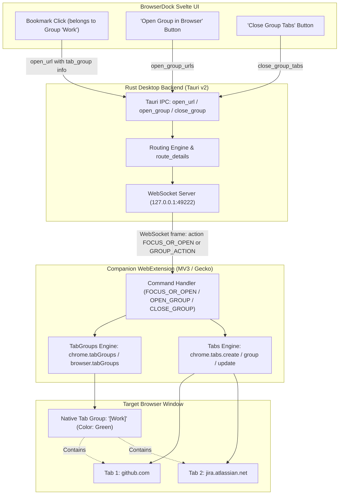

# Architectural & Implementation Plan: Browser Tab Groups Integration

**Implementation status (2026-09-20):** Implemented across companion v1.0.4, Rust and Svelte. Current contracts are in [SPEC §4.2.2](../SPECIFICATION.md#422-native-browser-tab-groups-companion-v104); checks and native acceptance limits are recorded in [PROGRESS](../PROGRESS.md). The recommended default-on setting was selected. The draft’s atomic batch claim is replaced by bounded, non-retried batches with partial-failure reporting. Mixed launch options split into separate browser/container/profile batches. Desktop commands live in `src-tauri/src/lib.rs`, and the compact poll digest carries group title/color to the UI.

This plan outlines how native browser tab groups in Chrome, Edge, and modern Firefox (139+) can integrate with BrowserDock across the WebExtension companion, WebSocket IPC protocol, Rust desktop backend, and Svelte UI.

---

## 1. Goal Description

Modern browsers (Google Chrome 89+, Microsoft Edge, and Firefox 138/139+) support native **Tab Groups** with visual colored headers, titles, and collapsible sections. 

BrowserDock currently has its own internal grouping concept for bookmarks (`Group { id, name, color, sort_order, collapsed, private }`), but when launching bookmarks or focusing tabs via the companion extension:
1. Tabs are opened as standalone, ungrouped tabs in the browser window.
2. The companion's inventory (`TABS_SYNC` / `TABS_SYNC_PAGE`) does not report tab group IDs or group titles/colors.
3. Users cannot open an entire BrowserDock bookmark group as a native tab group in their browser, nor can they close all tabs belonging to a group.

Integrating browser tab groups with BrowserDock will bridge this gap, enabling:
- **Automatic Grouping on Launch**: Opening bookmarks belonging to a BrowserDock group automatically places them into a corresponding colored tab group in Chrome, Edge, or Firefox.
- **"Open All in Tab Group" Action**: Instantly launch or focus all bookmarks in a dock group into a single organized browser tab group.
- **Group-Aware Tab Inventory & Closing**: Companion reports tab group membership, allowing the dock to show which group an open tab belongs to, and providing a 1-click "Close Group Tabs" action.

---

## 2. Browser API Capabilities & Constraints Matrix

Based on our research into `chrome.tabGroups` and `browser.tabGroups`:

| Feature / Dimension | Google Chrome (89+) | Microsoft Edge | Mozilla Firefox (139+) | Mullvad Browser |
|---|---|---|---|---|
| **API Namespace** | `chrome.tabGroups`, `chrome.tabs.group` | `chrome.tabGroups`, `chrome.tabs.group` | `browser.tabGroups`, `browser.tabs.group` | Inherits Gecko, but tab groups may be disabled/restricted in anti-fingerprint profile |
| **Manifest Permission** | `"tabGroups"` in `permissions` | `"tabGroups"` in `permissions` | `"tabGroups"` in `permissions` | `"tabGroups"` in `permissions` |
| **Color Support** | 9 standard colors (`grey`, `blue`, `red`, `yellow`, `green`, `pink`, `purple`, `cyan`, `orange`) | Same 9 standard colors | Same 9 standard colors | Same 9 standard colors |
| **Ungroup API** | `chrome.tabs.ungroup(tabIds)` | `chrome.tabs.ungroup(tabIds)` | `browser.tabs.ungroup(tabIds)` | `browser.tabs.ungroup(tabIds)` |
| **Query Groups** | `chrome.tabGroups.query()` | `chrome.tabGroups.query()` | `browser.tabGroups.query()` | `browser.tabGroups.query()` |
| **Shared Groups** | Chrome 137+ (`shared: boolean`) | Varies | Not supported | Not supported |
| **Fallback if unsupported** | N/A (supported since v89) | N/A (supported) | If Firefox < 139 or disabled, gracefully degrade to regular tabs | Degradation to regular tabs |

> [!NOTE]
> All 9 group colors in Chrome/Edge/Firefox (`grey`, `blue`, `red`, `yellow`, `green`, `pink`, `purple`, `cyan`, `orange`) can be mapped directly to and from BrowserDock group hex colors (`#b8edc9`, `#4285F4`, etc.) using nearest-color matching.

---

## 3. Integration Architecture & Data Flow



---

## 4. User Review Required

> [!IMPORTANT]
> **Extension Permissions Update:**
> Adding `"tabGroups"` to `manifest.json` for Chromium and Gecko builds will prompt users updating the unpacked extension about new permissions (*"View and manage your tab groups"*). Existing permissions (`tabs`, `storage`, `alarms`, `contextualIdentities`, `cookies`) remain unchanged.

> [!IMPORTANT]
> **Opt-In vs. Default Grouping Policy:**
> When opening an individual bookmark that belongs to a group in BrowserDock:
> - **Option A (Strict Mode)**: Only group tabs when the user explicitly clicks "Open Group as Tab Group", or if a bookmark has `browser_options.tab_group: true`.
> - **Option B (Seamless Sync)**: Whenever opening *any* bookmark that has a `group_id`, automatically find or create a native browser tab group matching the dock group's name and color.
> - **Recommendation**: Option B with a dock setting `settings.auto_tab_groups` (default: `true`, can be toggled off in Settings).

---

## 5. Proposed Changes

### Component 1: WebExtension Companion (`extension/`)

#### [MODIFY] `extension/chromium/manifest.json` & `extension/gecko/manifest.json`
- Add `"tabGroups"` to `"permissions"` array.
- For Gecko, bump `browser_specific_settings.gecko.strict_min_version` recommendation or add feature-check guard `Boolean(chrome.tabGroups || browser.tabGroups)`.

#### [MODIFY] `extension/src/core.js`
- **Tab Group Resolution & Creation**:
  Add helper `ensureTabGroup(windowId, title, colorHex)`:
  - Checks if a tab group with the matching `title` already exists in `windowId`.
  - Maps hex color (e.g. `#b8edc9`) to closest enum value (`green`, `blue`, etc.).
  - Calls `chrome.tabs.group({ tabIds, groupId })` or creates a new group and calls `chrome.tabGroups.update(groupId, { title, color })`.
- **`FOCUS_OR_OPEN` Action Update**:
  - Accept optional `tab_group: { name: string, color?: string, collapsed?: boolean }`.
  - When opening a new tab or focusing, if `tab_group` is provided and the browser supports tab groups, add the tab to the group using `chrome.tabs.group({ tabIds: [created.id], groupId })`.
- **New Action: `OPEN_GROUP`**:
  - Accepts `{ id, action: "OPEN_GROUP", group_name, group_color, urls: string[], container, profile }`.
  - Opens all tabs in the target window and binds them together into a single tab group atomically.
- **New Action: `CLOSE_GROUP`**:
  - Accepts `{ id, action: "CLOSE_GROUP", group_name, container }`.
  - Finds tab group matching `group_name` (or tabs belonging to it) and closes them with `tabs.remove`.
- **Inventory Sync Enrichment (`inventory()`)**:
  - Query tab `groupId` in `inventory()` (if `groupId !== -1` / `TAB_GROUP_ID_NONE`).
  - Cache active `tabGroups.query({})` to map `groupId -> { title, color, collapsed }`.
  - Include optional `groupTitle` on tab inventory items so BrowserDock knows which browser group contains each open tab.

---

### Component 2: WebSocket Protocol & Rust Backend (`src-tauri/`)

#### [MODIFY] `src-tauri/src/ws_protocol.rs`
- Add `tab_group: Option<TabGroupHint>` to `Tab` and outgoing action schemas.
```rust
#[derive(Clone, Debug, Deserialize, Serialize)]
pub struct TabGroupHint {
    pub name: String,
    pub color: Option<String>,
    pub collapsed: Option<bool>,
}

#[derive(Clone, Debug, Deserialize, Serialize)]
pub struct Tab {
    pub id: i64,
    pub url: String,
    pub title: String,
    #[serde(default, rename = "cookieStoreId", skip_serializing_if = "Option::is_none")]
    pub cookie_store_id: Option<String>,
    #[serde(default, rename = "groupTitle", skip_serializing_if = "Option::is_none")]
    pub group_title: Option<String>,
}
```

#### [MODIFY] `src-tauri/src/ws_server.rs`
- Extend `focus_or_open_with_options` to accept `Option<&TabGroupHint>`.
- Add `open_group_tabs(browser, urls, group_hint, container, profile)` method on `ServerHandle`.
- Add `close_group_tabs(browser, group_name, container, profile)` method on `ServerHandle`.

#### [MODIFY] `src-tauri/src/dispatch.rs` & `src-tauri/src/desktop.rs`
- In `open_url_with_options`, extract `group_id` from the resolved bookmark, look up the Group definition in config/vault, and pass the `TabGroupHint { name, color, collapsed }` down to the companion.
- Implement Tauri desktop commands:
  - `open_group { group_id: String, private: bool, browser_id?: Option<String> }`: Opens all bookmarks in a group into a single browser tab group.
  - `close_group_tabs { group_id: String, private: bool }`: Closes the browser tab group associated with the dock group.

---

### Component 3: Frontend UI (`src/`)

#### [MODIFY] `src/lib/types.ts`
- Update `Tab` and `Instance` types with optional `groupTitle?: string`.
- Update `Settings` with `auto_tab_groups: boolean`.

#### [MODIFY] `src/lib/BookmarkList.svelte` & `src/lib/GroupEditor.svelte`
- Add group header quick actions:
  - **"Open Group in Browser"** icon button (folder with arrow or tab group icon) next to the group header pencil icon.
  - **"Close Group Tabs"** icon button when any tab in that group is currently open.
- In bookmark rows, if a tab is open inside a browser tab group, show a subtle pill/badge matching the browser group's title and color.

#### [MODIFY] `src/lib/SettingsView.svelte`
- Add toggle: *"Sync Bookmark Groups to Browser Tab Groups (Firefox 139+, Chrome, Edge)"*.

---

## 6. Color Mapping Strategy

Browser tab groups only accept 9 specific color names:
`["grey", "blue", "red", "yellow", "green", "pink", "purple", "cyan", "orange"]`.

BrowserDock allows custom hex colors (e.g. `#b8edc9`). The companion will include a simple Euclidean distance matcher in RGB space between the user's hex color and the canonical sRGB values of the 9 browser group colors, ensuring consistent color matching across browsers.

---

## 7. Verification Plan

### Automated Tests
- **Extension Tests** (`extension/test/*.js`):
  - Unit tests for `ensureTabGroup` and color mapping algorithm.
  - Tests verifying `FOCUS_OR_OPEN` with `tab_group` option creates/joins tab groups.
  - Tests for `OPEN_GROUP` and `CLOSE_GROUP` action handlers and response shapes.
  - Tests ensuring graceful degradation when `chrome.tabGroups` is `undefined` (e.g., older Firefox or strict private window).
- **Rust Core Tests** (`src-tauri/`):
  - Serialization/deserialization tests for `TabGroupHint` in `ws_protocol.rs`.
  - Protocol tests for `open_group` and `close_group_tabs`.

### Manual Verification
1. **Google Chrome & Microsoft Edge**:
   - Pair companion extension.
   - Click "Open Group" on a BrowserDock group containing 3 bookmarks.
   - Verify that Chrome/Edge opens the 3 tabs and automatically collapses or colors them into a named tab group.
2. **Mozilla Firefox (139+)**:
   - Verify native tab group creation and tab assignment in Firefox.
3. **Fallback & Resistance**:
   - Verify that Mullvad Browser or older Firefox versions without `tabGroups` API still open normal tabs without errors or crashes.
