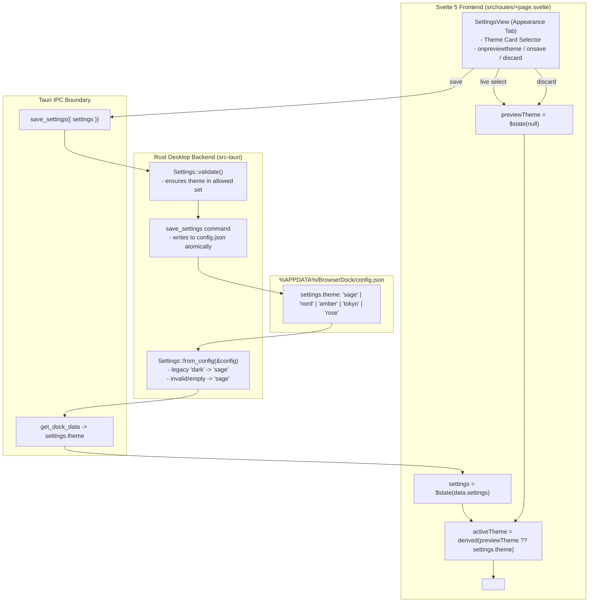

# Architectural & Implementation Plan: BrowserDock Theme Settings (5 Themes)

**Target audience:** Implementer AI Agent
**Repo:** `/home/raywan/gemini` (Tauri v2 + Svelte 5 + Tailwind v3, Windows target)
**Authoritative specifications:** [SPECIFICATION.md](../SPECIFICATION.md) (§3.1, §5), [PROGRESS.md](../PROGRESS.md), skill `browser-dock-builder`
**Status (2026-09-22):** Implemented. The original plan follows; current contracts are in [SPECIFICATION.md](../SPECIFICATION.md) and verification/remaining native acceptance are in [PROGRESS.md](../PROGRESS.md). Contrast checks cover opaque base surfaces; the memory target still requires native Windows measurement.

---

## 1. Executive Summary & Context

BrowserDock currently lacks a theme selection setting in the user interface. While `SPECIFICATION.md` §3.1 and `Config::default()` in `src-tauri/src/config.rs` originally scaffolded `"theme": "dark"` in the config schema, the dock UI is currently hardcoded to a single dark slate and mint palette (`#171c1e` surface and `#b8edc9` accent), with hardcoded RGB values in `src/routes/+page.svelte` and `src/lib/SettingsView.svelte`.

This specification establishes:
1. **5 Curated Themes**: Carefully crafted for BrowserDock's compact, floating Windows acrylic/translucent dock aesthetic, satisfying WCAG AA contrast standards while honoring the strict **< 40 MB memory invariant** (zero third-party UI libraries, purely native CSS custom properties).
2. **Schema & Backend Contracts**: Backward-compatible extension of `Settings` in `src-tauri/src/settings.rs` with automatic migration from legacy `"dark"` to `"sage"`, strict validation, and config round-tripping.
3. **Frontend Architecture**: A centralized theme registry (`src/lib/themes.ts`), CSS variable tokens in `src/app.css`, and a visual theme selector in `SettingsView.svelte` with instant live preview and clean discard/revert support.
4. **Step-by-step Implementation Work Packages**: Ready for direct, phased execution by an implementer AI agent.

---

## 2. The 5 Curated Themes

Every theme is tuned for dark/translucent floating dock usage on Windows. Each theme defines a complete token set:
- `--surface-rgb`: Space-separated decimal RGB values for dynamic alpha compositing with user opacity (`calc(0.96 * var(--dock-opacity, 1))`).
- `--surface`: Base surface color with baseline alpha.
- `--text`: High-contrast foreground text (minimum 7:1 contrast on surface).
- `--muted`: Secondary labels, shortcuts, and captions (minimum 4.5:1 contrast).
- `--accent`: Active indicator, focused controls, and primary button background.
- `--accent-contrast`: High-contrast text rendered on top of `--accent` (for primary action buttons).
- `--accent-hover`: Brightened or saturated tone for hover states.
- `--accent-alpha-12` / `--accent-alpha-33`: Alpha variants for badge backgrounds, search highlights, and focus borders.

```
+-----------------------------------------------------------------------------------------+
| Theme ID  | Name           | Surface (RGB)            | Accent    | Mood / Identity     |
+-----------------------------------------------------------------------------------------+
| sage      | Sage Mint      | #171c1e (23, 28, 30)     | #b8edc9   | Classic botanical   |
| nord      | Nord Frost     | #1e222a (30, 34, 42)     | #88c0d0   | Arctic cool slate   |
| amber     | Midnight Amber | #151618 (21, 22, 24)     | #f5a742   | Warm CRT / cyber    |
| tokyo     | Tokyo Violet   | #1a1b26 (26, 27, 38)     | #bb9af7   | Synthwave indigo    |
| rose      | Rosé Pine      | #191724 (25, 23, 36)     | #ebbcba   | Warm velvet dusk    |
+-----------------------------------------------------------------------------------------+
```

### 2.1 Theme 1: `sage` — Sage Mint (Default / Signature)
* **Concept:** BrowserDock's signature botanical dark slate. Minimal eye fatigue, organic, crisp.
* **Compatibility:** Default theme. Legacy `"dark"` config entries automatically map to this ID.
* **Tokens:**
  * `--surface-rgb`: `23 28 30`
  * `--surface`: `#171c1ef5`
  * `--text`: `#e4e9e5`
  * `--muted`: `#89928f`
  * `--accent`: `#b8edc9`
  * `--accent-contrast`: `#183524` (dark forest green on mint)
  * `--accent-hover`: `#ccf5d8`
  * `--accent-alpha-12`: `rgba(184, 237, 201, 0.12)`
  * `--accent-alpha-33`: `rgba(184, 237, 201, 0.33)`

### 2.2 Theme 2: `nord` — Nord Frost
* **Concept:** Inspired by the arctic Scandinavian Nord palette. Deep polar night with frost cyan accents. Highly focused, cool, and clean.
* **Tokens:**
  * `--surface-rgb`: `30 34 42`
  * `--surface`: `#1e222af5`
  * `--text`: `#eceff4`
  * `--muted`: `#8892b0`
  * `--accent`: `#88c0d0`
  * `--accent-contrast`: `#152d35` (deep polar cyan on frost)
  * `--accent-hover`: `#a3d4e2`
  * `--accent-alpha-12`: `rgba(136, 192, 208, 0.12)`
  * `--accent-alpha-33`: `rgba(136, 192, 208, 0.33)`

### 2.3 Theme 3: `amber` — Midnight Amber
* **Concept:** Obsidian dark surface paired with warm incandescent amber/gold. Ideal for night-time sessions and vintage terminal enthusiasts; eliminates blue-light glare.
* **Tokens:**
  * `--surface-rgb`: `21 22 24`
  * `--surface`: `#151618f5`
  * `--text`: `#f5ede2`
  * `--muted`: `#9a9184`
  * `--accent`: `#f5a742`
  * `--accent-contrast`: `#2b1700` (deep burnt umber on amber)
  * `--accent-hover`: `#ffbe6a`
  * `--accent-alpha-12`: `rgba(245, 167, 66, 0.12)`
  * `--accent-alpha-33`: `rgba(245, 167, 66, 0.33)`

### 2.4 Theme 4: `tokyo` — Tokyo Violet
* **Concept:** Deep indigo-tinted midnight surface paired with electric neon lilac. Modern developer synthwave aesthetic with bold, vibrant accents.
* **Tokens:**
  * `--surface-rgb`: `26 27 38`
  * `--surface`: `#1a1b26f5`
  * `--text`: `#c0caf5`
  * `--muted`: `#7982a9`
  * `--accent`: `#bb9af7`
  * `--accent-contrast`: `#201438` (deep purple night on lilac)
  * `--accent-hover`: `#d0b8f9`
  * `--accent-alpha-12`: `rgba(187, 154, 247, 0.12)`
  * `--accent-alpha-33`: `rgba(187, 154, 247, 0.33)`

### 2.5 Theme 5: `rose` — Rosé Pine
* **Concept:** Soft velvet pine background paired with warm dusty rose/coral. Gentle, elegant, muted high-comfort dark aesthetic.
* **Tokens:**
  * `--surface-rgb`: `25 23 36`
  * `--surface`: `#191724f5`
  * `--text`: `#e0def4`
  * `--muted`: `#908caa`
  * `--accent`: `#ebbcba`
  * `--accent-contrast`: `#261620` (deep plum on blush)
  * `--accent-hover`: `#f4cdc9`
  * `--accent-alpha-12`: `rgba(235, 188, 186, 0.12)`
  * `--accent-alpha-33`: `rgba(235, 188, 186, 0.33)`

---

## 3. System Architecture & Data Flow



---

## 4. Phased Implementation Plan for Implementer AI Agent

Follow these work packages sequentially. Do not combine independent changes or skip verification steps.

### Work Package 1: Rust Backend Schema & Settings Validation
**Files touched:**
- `src-tauri/src/settings.rs`
- `src-tauri/src/config.rs`
- `src-tauri/core/tests/settings_v2.rs`

**Detailed Steps:**
1. In `src-tauri/src/settings.rs`:
   * Add `#[serde(default = "default_theme")] pub theme: String` to `pub struct Settings`.
   * Add helper function:
     ```rust
     fn default_theme() -> String {
         "sage".into()
     }
     ```
   * In `Settings::from_config(c: &Config)`:
     ```rust
     theme: c
         .settings
         .get("theme")
         .and_then(|v| v.as_str())
         .map(|s| if s == "dark" { "sage" } else { s })
         .unwrap_or("sage")
         .into(),
     ```
   * In `Settings::validate(&self)`:
     ```rust
     const VALID_THEMES: &[&str] = &["sage", "nord", "amber", "tokyo", "rose"];
     if !VALID_THEMES.contains(&self.theme.as_str()) {
         return Err("Theme must be one of: sage, nord, amber, tokyo, rose".into());
     }
     ```
2. In `src-tauri/src/config.rs`:
   * Update `Config::default()` line 70: change `settings.insert("theme".into(), json!("dark"));` to `settings.insert("theme".into(), json!("sage"));`.
3. In `src-tauri/core/tests/settings_v2.rs`:
   * Add test `legacy_theme_dark_migrates_to_sage_and_invalid_themes_fail_validation`:
     * Assert `Config::default()` yields `settings.theme == "sage"`.
     * Insert `"dark"` into `config.settings`, assert `Settings::from_config` produces `"sage"`.
     * Assert valid theme IDs (`"nord"`, `"amber"`, `"tokyo"`, `"rose"`) pass `validate()`.
     * Assert invalid theme ID (`"neon"`) returns `Err`.
     * Assert serialized settings contain `"theme": "sage"`.

**Verification:**
```bash
export PATH="/tmp/browserdock-rustup/toolchains/stable-x86_64-unknown-linux-gnu/bin:$PATH"
export CARGO_HOME=/tmp/browserdock-cargo
export RUSTUP_HOME=/tmp/browserdock-rustup
cargo test --locked --manifest-path src-tauri/core/Cargo.toml
```

---

### Work Package 2: Frontend Types & Centralized Theme Registry
**Files touched:**
- `src/lib/types.ts`
- `src/lib/themes.ts` (new file)
- `test/theme.test.mjs` (new file)

**Detailed Steps:**
1. In `src/lib/types.ts`:
   * Export `ThemeId`:
     ```ts
     export type ThemeId = "sage" | "nord" | "amber" | "tokyo" | "rose";
     ```
   * Update `export type Settings`:
     * Add `theme: ThemeId;`.
2. Create `src/lib/themes.ts`:
   ```ts
   import type { ThemeId } from "./types";

   export interface ThemeMeta {
     id: ThemeId;
     label: string;
     description: string;
     surface: string; // Preview hex
     accent: string;  // Preview hex
     text: string;    // Preview hex
   }

   export const THEMES: readonly ThemeMeta[] = [
     {
       id: "sage",
       label: "Sage Mint",
       description: "Botanical dark slate with fresh mint accents",
       surface: "#171c1e",
       accent: "#b8edc9",
       text: "#e4e9e5"
     },
     {
       id: "nord",
       label: "Nord Frost",
       description: "Cool arctic slate with glacier cyan highlights",
       surface: "#1e222a",
       accent: "#88c0d0",
       text: "#eceff4"
     },
     {
       id: "amber",
       label: "Midnight Amber",
       description: "Warm charcoal with radiant incandescent amber",
       surface: "#151618",
       accent: "#f5a742",
       text: "#f5ede2"
     },
     {
       id: "tokyo",
       label: "Tokyo Violet",
       description: "Deep midnight indigo with electric neon lilac",
       surface: "#1a1b26",
       accent: "#bb9af7",
       text: "#c0caf5"
     },
     {
       id: "rose",
       label: "Rosé Pine",
       description: "Soft velvet pine with warm dusty rose highlights",
       surface: "#191724",
       accent: "#ebbcba",
       text: "#e0def4"
     }
   ] as const;

   const THEME_SET = new Set<string>(THEMES.map(t => t.id));

   export function normalizeTheme(raw: unknown): ThemeId {
     if (typeof raw !== "string") return "sage";
     if (raw === "dark") return "sage";
     return THEME_SET.has(raw) ? (raw as ThemeId) : "sage";
   }
   ```
3. Create `test/theme.test.mjs`:
   * Test `normalizeTheme` maps `undefined`, `null`, `"dark"`, and unknown strings to `"sage"`.
   * Test `normalizeTheme` preserves valid theme IDs.
   * Test all 5 themes in `THEMES` have unique IDs, non-empty labels, and valid 7-char hex color codes.

**Verification:**
```bash
npm run test:ui
```

---

### Work Package 3: CSS Tokens & Theme Architecture
**Files touched:**
- `src/app.css`
- `src/routes/+page.svelte`
- `src/lib/SettingsView.svelte`

**Detailed Steps:**
1. In `src/app.css`:
   * Define `:root, [data-theme="sage"]` and the other 4 theme selectors (`[data-theme="nord"]`, `[data-theme="amber"]`, `[data-theme="tokyo"]`, `[data-theme="rose"]`).
   * Structure tokens in `src/app.css`:
     ```css
     :root,
     [data-theme="sage"] {
       color-scheme: dark;
       --surface-rgb: 23 28 30;
       --surface: #171c1ef5;
       --text: #e4e9e5;
       --muted: #89928f;
       --accent: #b8edc9;
       --accent-contrast: #183524;
       --accent-hover: #ccf5d8;
       --accent-alpha-12: rgba(184, 237, 201, 0.12);
       --accent-alpha-33: rgba(184, 237, 201, 0.33);
     }

     [data-theme="nord"] {
       color-scheme: dark;
       --surface-rgb: 30 34 42;
       --surface: #1e222af5;
       --text: #eceff4;
       --muted: #8892b0;
       --accent: #88c0d0;
       --accent-contrast: #152d35;
       --accent-hover: #a3d4e2;
       --accent-alpha-12: rgba(136, 192, 208, 0.12);
       --accent-alpha-33: rgba(136, 192, 208, 0.33);
     }

     [data-theme="amber"] {
       color-scheme: dark;
       --surface-rgb: 21 22 24;
       --surface: #151618f5;
       --text: #f5ede2;
       --muted: #9a9184;
       --accent: #f5a742;
       --accent-contrast: #2b1700;
       --accent-hover: #ffbe6a;
       --accent-alpha-12: rgba(245, 167, 66, 0.12);
       --accent-alpha-33: rgba(245, 167, 66, 0.33);
     }

     [data-theme="tokyo"] {
       color-scheme: dark;
       --surface-rgb: 26 27 38;
       --surface: #1a1b26f5;
       --text: #c0caf5;
       --muted: #7982a9;
       --accent: #bb9af7;
       --accent-contrast: #201438;
       --accent-hover: #d0b8f9;
       --accent-alpha-12: rgba(187, 154, 247, 0.12);
       --accent-alpha-33: rgba(187, 154, 247, 0.33);
     }

     [data-theme="rose"] {
       color-scheme: dark;
       --surface-rgb: 25 23 36;
       --surface: #191724f5;
       --text: #e0def4;
       --muted: #908caa;
       --accent: #ebbcba;
       --accent-contrast: #261620;
       --accent-hover: #f4cdc9;
       --accent-alpha-12: rgba(235, 188, 186, 0.12);
       --accent-alpha-33: rgba(235, 188, 186, 0.33);
     }
     ```
   * Update button styles in `src/app.css`:
     ```css
     .primary {
       background: var(--accent);
       color: var(--accent-contrast);
     }
     .primary:hover {
       background: var(--accent-hover);
     }
     ```
2. Replace hardcoded RGB literals in `src/routes/+page.svelte`:
   * Line 1010: change `background: rgb(23 28 30 / calc(0.96 * var(--dock-opacity, 1)));` to:
     ```css
     background: rgb(var(--surface-rgb) / calc(0.96 * var(--dock-opacity, 1)));
     transition: background-color 150ms ease, color 150ms ease;
     ```
   * Line 1255: change `.toast { background: rgb(23 28 30 / 0.97); }` to:
     ```css
     background: rgb(var(--surface-rgb) / 0.97);
     ```
   * Replace hardcoded mint alpha values (e.g. `#b8edc955`, `#b8edc914`) with `var(--accent-alpha-33)` and `var(--accent-alpha-12)`.
3. Replace hardcoded RGB in `src/lib/SettingsView.svelte`:
   * Line 434: change `.dirty-bar { background: rgb(23 28 30 / 0.97); }` to:
     ```css
     background: rgb(var(--surface-rgb) / 0.97);
     ```
   * Replace `.chip.on` hardcoded `#b8edc955` / `#b8edc90e` with `var(--accent-alpha-33)` and `var(--accent-alpha-12)`.

---

### Work Package 4: SettingsView UI Theme Selector & Live Preview
**Files touched:**
- `src/lib/SettingsView.svelte`
- `src/routes/+page.svelte`

**Detailed Steps:**
1. In `src/lib/SettingsView.svelte`:
   * Import `THEMES` and `normalizeTheme` from `./themes`.
   * Add prop `onpreviewtheme: (theme: ThemeId | null) => void` to component props.
   * In `onDestroy`: ensure `onpreviewtheme(null)` is called to clear any uncommitted preview.
   * In the `"appearance"` tab markup, add the Theme selector directly above or below Opacity:
     ```svelte
     <div class="theme-section">
       <span class="theme-label">Theme</span>
       <div class="theme-grid" role="radiogroup" aria-label="Theme selection">
         {#each THEMES as t}
           <button
             type="button"
             role="radio"
             aria-checked={form.theme === t.id}
             class="theme-card"
             class:selected={form.theme === t.id}
             onclick={() => {
               form.theme = t.id;
               onpreviewtheme(t.id);
             }}
           >
             <span class="theme-swatch" style:background={t.surface} style:border-color={t.accent}>
               <span class="theme-swatch-dot" style:background={t.accent}></span>
             </span>
             <span class="theme-card-info">
               <span class="theme-name">{t.label}</span>
               <small class="theme-desc">{t.description}</small>
             </span>
           </button>
         {/each}
       </div>
     </div>
     ```
   * Add component styles for `.theme-grid`, `.theme-card`, `.theme-swatch`, etc.:
     * Cards display cleanly in a responsive grid (`grid-template-columns: repeat(auto-fit, minmax(130px, 1fr))` or `1fr`).
     * Active theme card has an accent border: `border-color: var(--accent); background: var(--accent-alpha-12);`.
     * In `discard()`: call `onpreviewtheme(null)` so the live dock immediately reverts to `snapshot.theme`.
2. In `src/routes/+page.svelte`:
   * Import `normalizeTheme` from `$lib/themes`.
   * Initialize `theme` in `settings` default state: `theme: "sage"`.
   * In `get_dock_data` data loading:
     `settings = { ...data.settings, theme: normalizeTheme(data.settings.theme), ... };`
   * Add reactive state: `let previewTheme = $state<ThemeId | null>(null);`.
   * Derive active theme:
     `let activeTheme = $derived(previewTheme ?? settings.theme ?? "sage");`
   * Bind `data-theme={activeTheme}` to `<main>`:
     ```svelte
     <main
       data-theme={activeTheme}
       style:--dock-opacity={opacityPreview ?? settings.opacity}
       class:expanded
       class:strip
       onmouseenter={enter}
       onmouseleave={leave}
     >
     ```
   * Pass `onpreviewtheme={(th) => previewTheme = th}` to `<SettingsView>`.
   * In `saveSettings()`: clear preview (`previewTheme = null;`).

---

### Work Package 5: Full Verification & Mirroring
**Checks to execute:**
1. Rust tests:
   ```bash
   export PATH="/tmp/browserdock-rustup/toolchains/stable-x86_64-unknown-linux-gnu/bin:$PATH"
   export CARGO_HOME=/tmp/browserdock-cargo
   export RUSTUP_HOME=/tmp/browserdock-rustup
   cargo test --locked --manifest-path src-tauri/core/Cargo.toml
   ```
2. Frontend checks:
   ```bash
   npm run check
   npm run test:ui
   npm run build
   ```
3. Documentation & Status updates:
   * Update [SPECIFICATION.md](../SPECIFICATION.md) §3.1 settings schema to record all 5 theme values and `"sage"` default.
   * Update [PROGRESS.md](../PROGRESS.md) to record the completed theme setting feature and verification counts.
---

## 5. Invariants & Acceptance Criteria Checklist

- [ ] **Target Memory Invariant (< 40 MB)**: No external icon packs, CSS frameworks, or heavy state managers added. Pure Svelte 5 + native CSS custom properties.
- [ ] **Config Backwards Compatibility**: Legacy configs containing `"theme": "dark"` load without error and normalize to `"sage"`. Hand-edited invalid strings fallback to `"sage"`.
- [ ] **Zero Telemetry**: All color calculations and theme state remain 100% local.
- [ ] **Smooth Live Preview & Revert**: Selecting a theme applies immediately; clicking "Discard" reverts the theme immediately without requiring window reload.
- [ ] **Opacity Compatibility**: The background opacity slider (30%–100%) and edge-collapsed wake strip work identically across all 5 themes.
- [ ] **Browser Brand Preservation**: Firefox (#FF7139), Mullvad (#218838), Chrome (#4285F4), and Edge (#0078D7) badges remain legible and distinct against all 5 theme surfaces.
